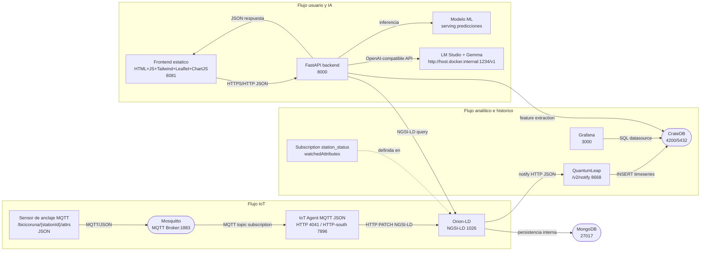
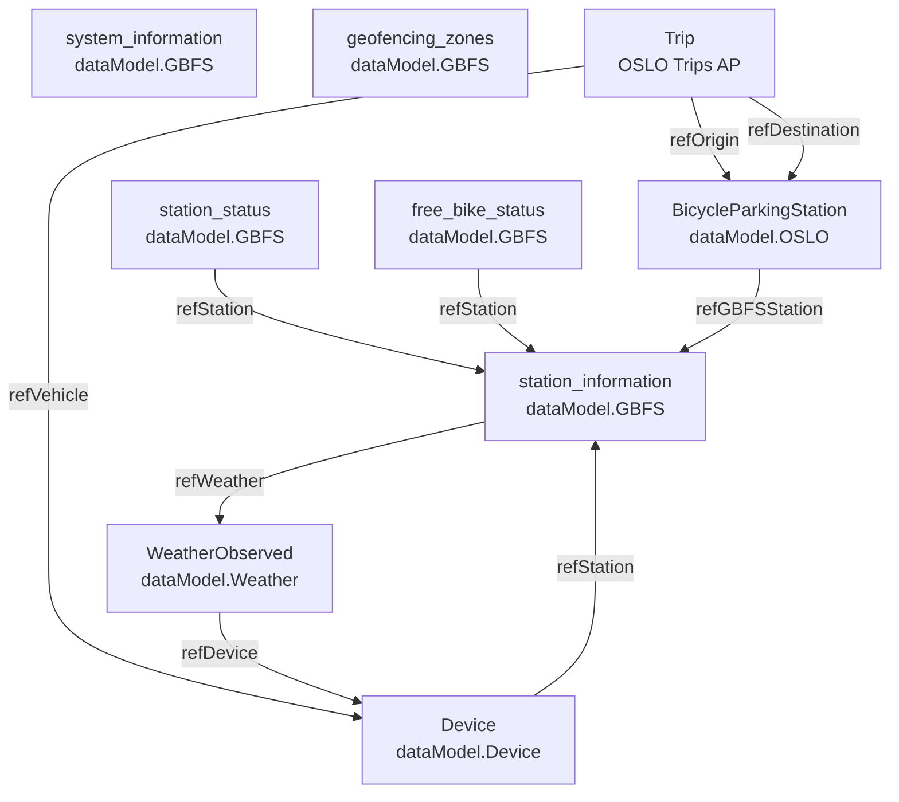

# APPLICATION.md — Smart Mobility Hub

**Escenario:** Gestión inteligente de sistemas de bicicletas compartidas multi-ciudad  
**Ciudad piloto:** A Coruña, Galicia  
**Versión del documento:** 1.0

---

## 1. Objetivo

**Smart Mobility Hub** es una plataforma inteligente de gestión, análisis y predicción de sistemas de bicicletas compartidas, diseñada con una arquitectura **multi-región agnóstica a ciudad** basada en estándares de datos abiertos (NGSI-LD, GBFS, OSLO). A Coruña actúa como ciudad piloto de validación.

A diferencia de soluciones propietarias de ciudad única, la plataforma emplea una estrategia de **interoperabilidad estándar** que permite incorporar nuevas ciudades de forma modular sin rediseño de infraestructura. El sistema ofrece dos capas complementarias: una **capa ciudadana** con mapa interactivo de disponibilidad en tiempo real, predicciones de demanda y asistente conversacional con acceso al contexto vivo de Orion Context Broker; y una **capa analítica** en Grafana local con dashboards parametrizados, heatmaps de demanda y correlación clima–uso.

La orografía costera de A Coruña y el efecto del viento atlántico se modelan como variables diferenciadoras en los análisis predictivos. El despliegue completo se orquesta mediante **Docker Compose en un único comando**, integrando componentes FIWARE obligatorios (Orion-LD, IoT Agent MQTT, QuantumLeap, CrateDB) con un backend FastAPI, frontend responsivo y LLM local (Gemma vía LM Studio).

Los datos de prueba utilizados son **sintéticos pero geográficamente coherentes con A Coruña**, asegurando validez en análisis de patrones y modelos predictivos.

---

## 2. Estado del Arte

**Sistemas existentes** como Bicing (Barcelona), BiciMad (Madrid), Vélib' (París), Lime y Bird operan con arquitecturas **propietarias y cerradas**, donde cada ciudad implementa su propio stack tecnológico, modelos de datos y API, dificultando la transferencia de soluciones o análisis comparativos entre regiones. Aunque estas plataformas ofrecen funcionalidad básica (mapa, disponibilidad, reserva), adolecen de:

- **Fragmentación de datos:** Cada sistema define sus propios esquemas; no hay estándar compartido para interoperabilidad entre ciudades.
- **Escalabilidad limitada:** Agregar una nueva ciudad requiere rediseño integral.
- **Opacidad analítica:** Acceso restringido a datos históricos para ML y análisis de movilidad sostenible.

**Smart Mobility Hub diferencia su enfoque** mediante:

1. **NGSI-LD nativo:** Usa el estándar FIWARE de contexto inteligente como contrato de datos. Todas las entidades (estaciones, bicicletas, observaciones meteorológicas) se modelan como objetos JSON-LD con relaciones explícitas (`Relationship`), permitiendo consultas estructuradas y evolución sin fragmentación.

2. **Interoperabilidad mediante GBFS/FIWARE:** La especificación GBFS (General Bikeshare Feed Specification) se materializa como entidades NGSI-LD (`station_information`, `station_status`, `free_bike_status`), transformando un feed orientado a consumo en datos semánticos operables e históricos.

3. **Movilidad intermodal (OSLO):** Integra el perfil OSLO (estándar europeo) para modelar viajes (`Trip`) y estaciones multimodales (`BicycleParkingStation`), facilitando futuros análisis de cambio modal.

4. **Machine Learning y predicción local:** Acumula series temporales en QuantumLeap/CrateDB, entrena modelos de demanda incorporando variables meteorológicas (viento, precipitación), y sirve predicciones a 30–60 minutos sin dependencia de APIs externas.

5. **Asistencia conversacional con contexto vivo:** Un LLM local (Gemma) ejecutado en LM Studio realiza **function calling** contra Orion-LD, respondiendo preguntas en lenguaje natural con datos actualizados de la ciudad seleccionada, sin exposición de datos externos.

Esta combinación (NGSI-LD + GBFS + OSLO + ML local + LLM local) constituye un modelo radicalmente diferente: datos abiertos, arquitectura escalable multi-región y análisis autónomo.

---

## 3. Funcionalidades Principales

La plataforma agrupa 14 funcionalidades en dos perfiles:

**Para el Ciudadano (Usuario Final):**
- Mapa interactivo multi-ciudad (F-01) con selector dinámico de región (F-02)
- Detalle de estación: bicis disponibles, anclajes libres, última actualización (F-03)
- Predicción de disponibilidad a 30 y 60 minutos por estación (F-04)
- Asistente IA conversacional con acceso en tiempo real a Orion (F-05)
- Panel de impacto ambiental: CO₂ ahorrado, km totales, viajes equivalentes (F-12)
- Interfaz responsiva para dispositivos móviles desde 360px (F-13)

**Para el Analista / Operador:**
- Dashboard histórico parametrizado por ciudad y estación en Grafana local (F-08)
- Heatmap de demanda por zonas de la ciudad (F-09)
- Predicción de redistribución: estaciones en riesgo de vaciarse o llenarse (F-10)
- Correlación clima–uso: impacto de viento y lluvia en demanda (F-11)

F-06 queda como trabajo futuro: planificador de ruta con perfil topográfico. F-07 está implementado mediante alertas SSE en tiempo real con gestión de favoritos. F-14 está implementado con el panel Grafana embebido vía iFrame con botón de alternancia Mapa/Dashboard.

### Funcionalidades detalladas (resumen del PRD)

| Código | Funcionalidad | Perfil | Prioridad | Estado |
|--------|--------------|--------|-----------|--------|
| F-01 | Mapa interactivo multi-ciudad con disponibilidad en tiempo real | Ciudadano | Alta | ✅ |
| F-02 | Selector de ciudad con cambio dinámico de contexto | Ciudadano | Alta | ✅ |
| F-03 | Detalle de estación: bicis, anclajes libres, última actualización | Ciudadano | Alta | ✅ |
| F-04 | Predicción de disponibilidad a 30 y 60 min por estación | Ciudadano | Alta | ✅ |
| F-05 | Asistente IA conversacional con function calling contra Orion | Ciudadano | Alta | ✅ |
| F-06 | Planificador de ruta con perfil topográfico (GeoPandas/OSM) | Ciudadano | Media | 🔜 |
| F-07 | Alertas push de disponibilidad en estaciones favoritas | Ciudadano | Media | ✅ |
| F-08 | Dashboard histórico parametrizado por ciudad/estación en Grafana | Analista | Alta | ✅ |
| F-09 | Heatmap de demanda por zonas de la ciudad | Analista | Alta | ✅ |
| F-10 | Predicción de redistribución: estaciones en riesgo | Analista | Alta | ✅ |
| F-11 | Correlación clima–uso: viento y precipitación vs demanda | Analista | Alta | ✅ |
| F-12 | Panel de impacto ambiental: CO₂ ahorrado, km, viajes | Ciudadano/Analista | Media | ✅ |
| F-13 | Interfaz web responsiva (desde 360 px) | Ciudadano | Alta | ✅ |
| F-14 | Paneles Grafana embebidos vía iFrame en frontend | Ciudadano/Analista | Media | ✅ |

---

## 4. Diagrama de Arquitectura

---

## 5. Diagrama del Modelo de Datos

---

*Documento generado como parte de la Práctica 3 — Gestión de Datos en Entornos Inteligentes, Universidade da Coruña.*