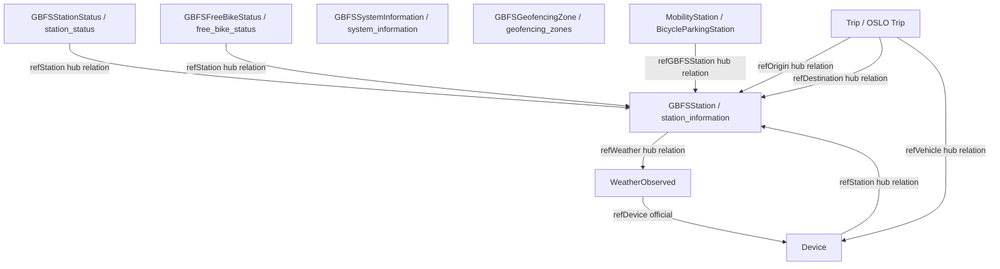

# APPLICATION.md — Smart Mobility Hub

**Escenario:** Gestión inteligente de sistemas de bicicletas compartidas multi-ciudad  
**Ciudad piloto:** A Coruña, Galicia  
**Versión del documento:** 1.0

---

## 1. Objetivo

**Smart Mobility Hub** es una plataforma inteligente de gestión, análisis y predicción de sistemas de bicicletas compartidas, diseñada con una arquitectura **multi-región agnóstica a ciudad** basada en estándares de datos abiertos (NGSI-LD, GBFS, OSLO). A Coruña actúa como ciudad piloto de validación.

A diferencia de soluciones propietarias de ciudad única, la plataforma emplea una estrategia de **interoperabilidad estándar** que permite incorporar nuevas ciudades de forma modular sin rediseño de infraestructura. El sistema ofrece dos capas complementarias: una **capa ciudadana** con mapa interactivo de disponibilidad en tiempo real, predicciones de demanda y asistente conversacional con acceso al contexto vivo de Orion Context Broker; y una **capa analítica** en Grafana local con dashboards parametrizados, heatmaps de demanda y correlación clima–uso.

La orografía costera de A Coruña y el efecto del viento atlántico se modelan como variables diferenciadoras en los análisis predictivos. El despliegue completo se orquesta mediante **Docker Compose en un único comando**, integrando componentes FIWARE obligatorios (Orion-LD, IoT Agent MQTT, QuantumLeap, CrateDB) con un backend FastAPI, frontend responsivo y LLM local (Gemma vía LM Studio).

Los datos de prueba utilizados son **sintéticos pero geográficamente coherentes con A Coruña**, asegurando validez en análisis de patrones y modelos predictivos.

---

## 2. Estado del Arte

**Sistemas existentes** como Bicing (Barcelona), BiciMad (Madrid), Vélib' (París), Lime y Bird operan con arquitecturas **propietarias y cerradas**, donde cada ciudad implementa su propio stack tecnológico, modelos de datos y API, dificultando la transferencia de soluciones o análisis comparativos entre regiones. Aunque estas plataformas ofrecen funcionalidad básica (mapa, disponibilidad, reserva), adolecen de:

- **Fragmentación de datos:** Cada sistema define sus propios esquemas; no hay estándar compartido para interoperabilidad entre ciudades.
- **Escalabilidad limitada:** Agregar una nueva ciudad requiere rediseño integral.
- **Opacidad analítica:** Acceso restringido a datos históricos para ML y análisis de movilidad sostenible.

**Smart Mobility Hub diferencia su enfoque** mediante:

1. **NGSI-LD nativo:** Usa el estándar FIWARE de contexto inteligente como contrato de datos. Todas las entidades (estaciones, bicicletas, observaciones meteorológicas) se modelan como objetos JSON-LD con relaciones explícitas (`Relationship`), permitiendo consultas estructuradas y evolución sin fragmentación.

2. **Interoperabilidad mediante GBFS/FIWARE:** La especificación GBFS (General Bikeshare Feed Specification) se materializa como entidades NGSI-LD (`GBFSStation`, `GBFSStationStatus`, `GBFSFreeBikeStatus`), transformando un feed orientado a consumo en datos semánticos operables e históricos.

3. **Movilidad intermodal (OSLO):** Integra el perfil OSLO (estándar europeo) para modelar viajes (`Trip`) y estaciones multimodales (`MobilityStation`), facilitando futuros análisis de cambio modal.

4. **Machine Learning y predicción local:** Acumula series temporales en QuantumLeap/CrateDB, entrena modelos de demanda incorporando variables meteorológicas (viento, precipitación), y sirve predicciones a 30–60 minutos sin dependencia de APIs externas.

5. **Asistencia conversacional con contexto vivo:** Un LLM local (Gemma) ejecutado en LM Studio realiza **function calling** contra Orion-LD, respondiendo preguntas en lenguaje natural con datos actualizados de la ciudad seleccionada, sin exposición de datos externos.

Esta combinación (NGSI-LD + GBFS + OSLO + ML local + LLM local) constituye un modelo radicalmente diferente: datos abiertos, arquitectura escalable multi-región y análisis autónomo.

---

## 3. Funcionalidades Principales

La plataforma agrupa 15 funcionalidades en tres perfiles:

**Para el Ciudadano (Usuario Final):**
- Mapa interactivo multi-ciudad (F-01) con selector dinámico de región (F-02)
- Detalle de estación: bicis disponibles, anclajes libres, última actualización (F-03)
- Predicción de disponibilidad a 30 y 60 minutos por estación (F-04)
- Asistente IA conversacional con acceso en tiempo real a Orion (F-05)
- Panel de impacto ambiental: CO₂ ahorrado, km totales, viajes equivalentes (F-08)
- Interfaz responsiva para dispositivos móviles desde 360px (F-09)

**Para el Analista / Operador:**
- Dashboard histórico parametrizado por ciudad y estación en Grafana local (F-10)
- Heatmap de demanda por zonas de la ciudad (F-11)
- Predicción de redistribución: estaciones en riesgo de vaciarse o llenarse (F-12)
- Correlación clima–uso: impacto de viento y lluvia en demanda (F-13)
F-06, F-07 y F-14 quedan como trabajo futuro: planificador topográfico, alertas push web e iFrame de Grafana.

---

## 4. Resumen Técnico

**Mapa y Disponibilidad:** El mapa carga en <3 segundos desde Orion-LD, codificado por color (verde: >5 bicis, amarillo: 1–5, rojo: 0). El planificador de rutas integra GeoPandas/OSM para perfil de elevación. Predicciones de demanda (30–60 min) usando histórico + variables meteorológicas (viento, precipitación) con scikit-learn, MAE <2 bicicletas.

**Dashboards y Analítica:** Grafana local (stack `smartmobilityhub`) conectada a CrateDB, parametrizada por `$city` y `$station`. Heatmap de demanda por zonas, correlación clima–uso (windSpeed, precipitation), panel sostenibilidad (CO₂ ahorrado 0.21 kg/km, km totales, viajes). Datos actualizados desde QuantumLeap/CrateDB mediante SQL.

**Asistencia IA:** LLM local (Gemma vía LM Studio) ejecuta function calling contra Orion-LD, respondiendo consultas en lenguaje natural (<5s latencia). Sin dependencias externas, privacidad garantizada.

---

## 5. Diagrama de Arquitectura

---

## 6. Diagrama del Modelo de Datos

---

## 7. Conclusiones Técnicas

Smart Mobility Hub materializa una visión de **interoperabilidad abierta y escalabilidad multi-región** mediante el stack FIWARE nativo. Orion-LD (NGSI-LD) actúa como fuente única de verdad para contexto operativo en tiempo real. IoT Agent MQTT traduce sensores a entidades semánticas. QuantumLeap + CrateDB acumulan series temporales para ML e histórico. Grafana local expone dashboards parametrizados. FastAPI orquesta lógica de negocio, function calling para LLM y predicciones.

El despliegue reproducible mediante Docker Compose en un único comando, sin configuración manual, asegura portabilidad a nuevas ciudades. La arquitectura es agnóstica a geografía pero adaptada a fenómenos locales (viento para A Coruña). Compliance con NGSI-LD, GBFS y OSLO garantiza futuras integraciones con sistemas intermodales y ecosistemas de datos abiertos urbanos.

---

*Documento generado como parte de la Práctica 3 — Gestión de Datos en Entornos Inteligentes, Universidade da Coruña.*