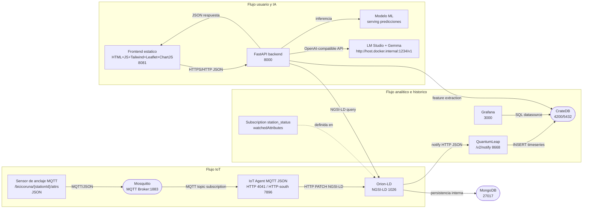

# Smart Mobility Hub - Architecture (v2.0)

## 0. Contexto y alcance

Smart Mobility Hub es una arquitectura FIWARE multi-ciudad para monitorizar y optimizar sistemas de bicicleta compartida. A Coruna es la ciudad piloto, pero todos los componentes y modelos se definen para escalar a nuevas ciudades sin rediseño estructural.

Principios:
- NGSI-LD nativo como contrato de datos.
- Entidades por estacion (por ejemplo `station_status`, `station_information`) para operaciones en tiempo real.
- Despliegue reproducible con Docker Compose en una red interna unica (`fiware_net`).
- Separacion entre flujo operacional (IoT y consulta en vivo), flujo analitico (historico) y flujo conversacional (LLM local).

---

## 1. Descripcion tecnica de componentes

### 1.1 Orion-LD (Context Broker NGSI-LD nativo)

Rol:
- Fuente de verdad de contexto en tiempo real para estaciones, estado de bicicletas, meteorologia y metadatos urbanos.
- Exposicion de API NGSI-LD para consultas (`GET /ngsi-ld/v1/entities`) y actualizaciones parciales (`PATCH /ngsi-ld/v1/entities/{id}/attrs`).
- Emision de notificaciones por suscripcion para persistencia historica en QuantumLeap.

Detalles tecnicos:
- Protocolo: HTTP/REST.
- Formatos: `application/ld+json` y JSON normalizado en notificaciones.
- Persistencia interna delegada a MongoDB (estado del broker y metadatos de entidades).

### 1.2 IoT Agent MQTT (JSON)

Rol:
- Adaptador de protocolo entre sensores MQTT y Orion-LD.
- Traduce payloads JSON publicados en topics MQTT a actualizaciones de atributos NGSI-LD.

Mapeo MQTT -> NGSI-LD:
- Topic de ingesta del dominio anclajes: `/bicicoruna/+/attrs`.
- El `+` representa el identificador de estacion/sensor (por ejemplo `ACORUNA-001`).
- Payload JSON esperado: `{ "num_bikes_available": 12, "ts": "2026-04-21T10:15:00Z" }`.
- Mapeo principal:
  - `num_bikes_available` (MQTT JSON) -> atributo `num_bikes_available` de la entidad `station_status` en Orion-LD.
- Operacion resultante en Orion-LD: `PATCH /ngsi-ld/v1/entities/{urn_station_status}/attrs`.

### 1.3 QuantumLeap + CrateDB

Rol:
- Pipeline historico para series temporales y analitica.
- QuantumLeap recibe notificaciones de Orion y persiste eventos de cambio en CrateDB.

Mecanismo de suscripcion notify:
- Orion-LD mantiene una Subscription sobre entidades `station_status`.
- Al detectar cambio en atributos observados, Orion envia `notify` a `http://quantumleap:8668/v2/notify`.
- QuantumLeap normaliza y escribe series temporales en CrateDB para analisis, dashboards y entrenamiento de modelos.

Adicionalmente, para alimentar correctamente los dashboards de correlación clima–uso y los heatmaps de demanda, Orion debe mantener suscripciones equivalentes para `WeatherObserved` y `Trip` que notifiquen a QuantumLeap. Ejemplo de curl para crear la suscripción de `WeatherObserved`:

```bash
curl -X POST http://localhost:1026/ngsi-ld/v1/subscriptions \
  -H "Content-Type: application/ld+json" \
  -H "Fiware-Service: smartmobilityhub" \
  -H "Fiware-ServicePath: /acoruna" \
  -d '{
    "type": "Subscription",
    "name": "weatherobserved_changes_to_quantumleap",
    "entities": [ { "type": "WeatherObserved" } ],
    "watchedAttributes": ["temperature","windSpeed","dateObserved"],
    "notification": { "attributes": ["temperature","windSpeed","dateObserved","location","refDevice"], "endpoint": { "uri": "http://quantumleap:8668/v2/notify", "accept": "application/json" } },
    "throttling": 5,
    "@context": [
      "https://smartdatamodels.org/context.jsonld",
      "https://raw.githubusercontent.com/smart-data-models/dataModel.Weather/master/context.jsonld"
    ]
  }'
```

Ejemplo equivalente para `Trip` (OSLO Mobility Trips AP):

```bash
curl -X POST http://localhost:1026/ngsi-ld/v1/subscriptions \
  -H "Content-Type: application/ld+json" \
  -H "Fiware-Service: smartmobilityhub" \
  -H "Fiware-ServicePath: /acoruna" \
  -d '{
    "id": "urn:ngsi-ld:Subscription:trip_to_quantumleap",
    "type": "Subscription",
    "name": "trip_changes_to_quantumleap",
    "description": "Notificar cambios de Trip para persistencia historica en QuantumLeap (heatmaps y correlacion demanda)",
    "entities": [ { "type": "Trip" } ],
    "watchedAttributes": ["departureTime","arrivalTime","refOrigin","refDestination"],
    "notification": { "attributes": ["departureTime","arrivalTime","refOrigin","refDestination"], "endpoint": { "uri": "http://quantumleap:8668/v2/notify", "accept": "application/json" } },
    "throttling": 5,
    "@context": [ "https://data.vlaanderen.be/doc/applicatieprofiel/mobiliteit-trips-en-aanbod/erkendestandaard/2020-04-23/context/mobiliteit-trips-en-aanbod-ap.jsonld" ]
  }'
```

**Notas sobre contextos NGSI-LD:**
- `WeatherObserved` usa el contexto estándar de Smart Data Models (dataModel.Weather).
- `Trip` usa el contexto oficial de la aplicación OSLO Mobility Trips and Offerings AP (Flandes).
- Ambas suscripciones comparten la misma estructura base: type `Subscription`, `watchedAttributes` selectivos y endpoint único en QuantumLeap.


### 1.4 FastAPI backend

Rol:
- Orquestador de negocio, API del frontend y punto de integracion de IA.
- Agrega datos de Orion-LD, consulta historico y expone endpoints de prediccion y chat.
- Implementa function calling para que el LLM consuma contexto vivo antes de responder.

Responsabilidades:
- Query NGSI-LD multi-ciudad (filtros por ciudad y tipo de entidad).
- ML serving (predicciones 30/60 min) basado en historico de CrateDB y/o features operacionales.
- Orquestacion de tools/functions: consultar Orion, enriquecer prompt, invocar LLM local, postprocesar respuesta.

### 1.5 LM Studio + Gemma (LLM local)

Rol:
- Inferencia local para asistente conversacional con latencia baja y control de datos.

Conexion desde FastAPI en Docker:
- Variable requerida: `LM_STUDIO_URL=http://host.docker.internal:1234/v1`.
- FastAPI usa ese endpoint compatible OpenAI para invocar Gemma.
- En Linux, se habilita la resolucion del host con `extra_hosts: ["host.docker.internal:host-gateway"]`.

### 1.6 Grafana (stack logical: smartmobilityhub)

Rol:
- Visualizacion operativa y analitica para perfil ciudadano y tecnico.
- Datasource: CrateDB via protocolo PostgreSQL (`cratedb:5432`).

Provisioning automatico:
- Grafana monta un archivo de datasource en `/etc/grafana/provisioning/datasources/`.
- Al arrancar, crea automaticamente la conexion a CrateDB sin configuracion manual en UI.

### 1.7 Frontend estatico (HTML + ES6 Modules + Tailwind + Leaflet + ChartJS)

Rol:
- Capa de experiencia de usuario para consulta de estaciones, mapa, predicciones y chat.
- Arquitectura modularizada en **5 módulos ES6 independientes** sin bundler (carga directa via `<script type="module">`).

**Módulos del frontend:**

1. **`js/utils.js`** (Utilities & Shared State)
   - Gestión centralizada de estado (`appState`): ciudad activa, estaciones, selecciones, caché de datos.
   - Configuración de ciudades (`CITY_CONFIG`): A Coruña, Vigo, Santiago con coordenadas y zoom.
   - Funciones utilitarias: `unwrapValue()`, `numberValue()`, `relativeTime()`, `escapeHtml()`.
   - Helpers para disponibilidad: `getAvailabilityClass/Color/Hex()` (verde >5 bicis, amarillo 1-5, rojo 0).
   - Gestión de conexión: `setConnection(online, message)` para feedback UI.
   - Fetch wrapper: `requestJSON(path, options)` con headers y manejo de errores.

2. **`js/map.js`** (Leaflet Map & Stations)
   - Inicialización de mapa Leaflet con tiles OpenStreetMap.
   - Carga de estaciones (`loadStations(city)`) desde `/api/stations?city={city}`.
   - Marcadores interactivos con popups mostrando bicis/anclajes disponibles.
   - Heatmap de densidad de viajes (`loadHeatmap()`) desde `/api/weather/trips/heatmap`.
   - Predicciones a 30/60 min (`fetchForecast(stationId)`) desde `/api/stations/{id}/forecast`.
   - Sidebar dinámico con detalles de estación seleccionada.
   - Refresh automático de statuses cada 30s.

3. **`js/chat.js`** (Chat Panel & LLM Integration)
   - Panel de chat funcional con historial de mensajes.
   - Envío de mensajes a `/api/chat` (POST) con `{city, message}` en payload.
   - UI diferenciada: mensajes usuario alineados derecha, asistente izquierda.
   - Estado "Escribiendo..." durante petición API.
   - Manejo de errores con feedback de conexión.


5. **`js/charts.js`** (Chart.js Visualization)
   - Gráfico doughnut: Ahorro CO₂ acumulado vs Objetivo restante.
   - Plugin personalizado con etiqueta central: "X.X kg" + "CO2 ahorrado".
   - Cálculo sostenibilidad: totalKg = Σ(trip_count × avg_distance × 0.21).
   - Objetivo: max(100, totalKg × 1.45).

**Arquitectura:**
- Módulos desacoplados que comparten estado via `appState` (Object exportado desde `utils.js`).
- Coordinador mínimo en `index.html` que inicializa módulos, gestiona ciudad activa y ciclo de refresh.
- Sin IIFE ni inyección global: imports/exports ES6 estándar.

Capacidades:
- Leaflet: mapa 2D y capas geograficas.
- ChartJS: tendencias y comparativas historicas/predictivas.
- Tailwind + JS: UI responsive y flujo interactivo.

### 1.8 MongoDB

Rol:
- Almacen persistente interno de Orion-LD.
- Guarda entidades y estructuras de contexto utilizadas por el broker.

---

## 2. Diagrama de arquitectura (Mermaid)



---

## 3. Flujo de datos detallado (4 ciclos criticos)

### 3.a Ciclo IoT: sensor anclaje MQTT -> IoT Agent -> Orion-LD

1. Sensor publica en topic MQTT:
- Origen: sensor de anclaje.
- Destino: broker Mosquitto.
- Protocolo: MQTT.
- Formato: JSON (`{"num_bikes_available": 12, "ts": "2026-04-21T10:15:00Z"}`).
- Topic: `/bicicoruna/ACORUNA-001/attrs` (matching `/bicicoruna/+/attrs`).

2. IoT Agent consume topic y aplica mapping:
- Origen: Mosquitto.
- Destino: IoT Agent MQTT JSON.
- Protocolo: MQTT interno.
- Formato: JSON.
- Transformacion: `num_bikes_available` -> atributo NGSI-LD homonimo en `station_status`.

3. IoT Agent actualiza Orion-LD:
- Origen: IoT Agent.
- Destino: Orion-LD.
- Protocolo: HTTP.
- Metodo: `PATCH`.
- Endpoint: `/ngsi-ld/v1/entities/urn:ngsi-ld:station_status:acoruna:ACORUNA-001/attrs`.
- Formato: `application/ld+json` (payload parcial de atributos).

### 3.b Ciclo historico: Orion notify -> QuantumLeap -> CrateDB

1. Cambio de estado en Orion:
- Origen: Orion-LD (entidad `station_status`).
- Trigger: cambio en watched attributes (ej.: `num_bikes_available`, `is_renting`, `last_reported`).

2. Notificacion a QuantumLeap:
- Origen: Orion-LD.
- Destino: QuantumLeap.
- Protocolo: HTTP.
- Metodo: `POST` (notify).
- Endpoint: `http://quantumleap:8668/v2/notify`.
- Formato: JSON de notificacion (atributos y metadatos).

3. Persistencia temporal en CrateDB:
- Origen: QuantumLeap.
- Destino: CrateDB.
- Protocolo: PostgreSQL wire / SQL interno.
- Formato: registros timeseries con timestamp, entidad, atributo y valor.

### 3.c Ciclo usuario: Frontend -> FastAPI -> Orion query -> JSON response

1. Peticion de UI:
- Origen: Frontend.
- Destino: FastAPI.
- Protocolo: HTTP/HTTPS.
- Metodo: `GET`.
- Formato: query params JSON-friendly (por ejemplo `city=acoruna&type=station_status`).

2. Consulta NGSI-LD:
- Origen: FastAPI.
- Destino: Orion-LD.
- Protocolo: HTTP.
- Metodo: `GET`.
- Endpoint ejemplo: `/ngsi-ld/v1/entities?type=station_status&q=city==acoruna&options=keyValues`.
- Parámetro `options=keyValues`: optimización que indica a Orion-LD devolver valores planos en lugar de objetos `{"type":"Property","value":X}`, reduciendo payload y simplificando parsing en FastAPI.
- Formato: `application/ld+json`.
- Fallback unwrap: FastAPI incluye helper `OrionClient.unwrap()` para compatibilidad con respuestas wrapped, garantizando robustez ante distintos formatos de Orion.

3. Respuesta al Frontend:
- Origen: FastAPI.
- Destino: Frontend.
- Protocolo: HTTP/HTTPS.
- Formato: JSON normalizado para UI (lista de estaciones + estado).

### 3.d Ciclo LLM: usuario -> FastAPI function calling -> Orion -> Gemma/LM Studio

1. Mensaje de usuario:
- Origen: Frontend chat.
- Destino: FastAPI.
- Protocolo: HTTP.
- Metodo: `POST /api/chat`.
- Formato: JSON (`{"city":"acoruna","message":"..."}`).

2. Function calling en FastAPI:
- FastAPI evalua intencion y decide tools (ejemplo: `get_station_status`, `get_weather`, `get_station_forecast`).
- Protocolo interno: llamada a funciones Python.

3. Recuperacion de contexto operativo:
- Origen: FastAPI.
- Destino: Orion-LD (y opcionalmente CrateDB para historico).
- Protocolo: HTTP (Orion) / SQL (CrateDB).
- Formato: JSON-LD -> JSON estructurado para contexto del LLM.

4. Inferencia LLM local:
- Origen: FastAPI.
- Destino: LM Studio + Gemma.
- Protocolo: HTTP (OpenAI-compatible API).
- Endpoint base: `http://host.docker.internal:1234/v1`.
- Formato: JSON (`chat/completions` o equivalente).

5. Respuesta final:
- Origen: FastAPI.
- Destino: Frontend.
- Protocolo: HTTP.
- Formato: JSON con respuesta natural y (si aplica) datos estructurados complementarios.

---

## 4. Tabla de red y puertos

| Servicio | Imagen Docker | Puerto interno | Puerto externo | URL de acceso |
|---|---|---:|---:|---|
| orion-ld | fiware/orion-ld:1.6.0 | 1026 | 1026 | http://localhost:1026 |
| mongodb | mongo:4.4 | 27017 | 27017 | mongodb://localhost:27017 |
| iot-agent-mqtt | fiware/iotagent-json:3.4.0 | 4041, 7896 | 4041, 7896 | http://localhost:4041 |
| mosquitto | eclipse-mosquitto:2.0 | 1883, 9001 | 1883, 9001 | mqtt://localhost:1883 |
| quantumleap | orchestracities/quantumleap:0.9.0 | 8668 | 8668 | http://localhost:8668 |
| cratedb | crate:5.4.3 | 4200, 5432 | 4200, 5432 | http://localhost:4200 |
| fastapi-backend | build ./backend/Dockerfile | 8000 | 8000 | http://localhost:8000 |
| grafana | grafana/grafana:10.2.0 | 3000 | 3000 | http://localhost:3000 |
| frontend | nginx:stable-alpine | 80 | 8081 | http://localhost:8081 |

---

## 5. docker-compose.yml completo y funcional

```yaml
version: "3.9"

networks:
  fiware_net:
    name: fiware_net
    driver: bridge

volumes:
  mongodb_data:
  cratedb_data:
  grafana_data:

services:
  mongodb:
    image: mongo:4.4
    container_name: mongodb
    networks:
      - fiware_net
    ports:
      - "27017:27017"
    volumes:
      - mongodb_data:/data/db
    restart: unless-stopped

  orion-ld:
    image: fiware/orion-ld:1.6.0
    container_name: orion-ld
    depends_on:
      - mongodb
    networks:
      - fiware_net
    ports:
      - "1026:1026"
    command: >
      -dbhost mongodb
      -logLevel INFO
      -corsOrigin __ALL
    healthcheck:
      test: ["CMD-SHELL", "curl -fsS http://localhost:1026/version || exit 1"]
      interval: 20s
      timeout: 5s
      retries: 10
      start_period: 20s
    restart: unless-stopped

  mosquitto:
    image: eclipse-mosquitto:2.0
    container_name: mosquitto
    networks:
      - fiware_net
    ports:
      - "1883:1883"
      - "9001:9001"
    volumes:
      - ./mosquitto/mosquitto.conf:/mosquitto/config/mosquitto.conf
    restart: unless-stopped

  iot-agent-mqtt:
    image: fiware/iotagent-json:3.4.0
    container_name: iot-agent-mqtt
    depends_on:
      mongodb:
        condition: service_started
      orion-ld:
        condition: service_healthy
      mosquitto:
        condition: service_started
    networks:
      - fiware_net
    ports:
      - "4041:4041"
      - "7896:7896"
    environment:
      - IOTA_CB_HOST=orion-ld
      - IOTA_CB_PORT=1026
      - IOTA_NORTH_PORT=4041
      - IOTA_HTTP_PORT=7896
      - IOTA_MONGO_HOST=mongodb
      - IOTA_MONGO_PORT=27017
      - IOTA_REGISTRY_TYPE=mongodb
      - IOTA_MONGO_DB=iotagentjson
      - IOTA_DEFAULT_RESOURCE=/iot/json
      - IOTA_DEFAULT_TRANSPORT=MQTT
      - IOTA_MQTT_HOST=mosquitto
      - IOTA_MQTT_PORT=1883
      - IOTA_TIMESTAMP=true
      - IOTA_LOG_LEVEL=INFO
      - IOTA_CB_NGSI_VERSION=ld
    healthcheck:
      test: ["CMD-SHELL", "curl -fsS http://localhost:4041/iot/about || exit 1"]
      interval: 20s
      timeout: 5s
      retries: 10
      start_period: 20s
    restart: unless-stopped

  cratedb:
    image: crate:5.4.3
    container_name: cratedb
    networks:
      - fiware_net
    ports:
      - "4200:4200"
      - "5432:5432"
    volumes:
      - cratedb_data:/data
    command: >
      crate
      -Ccluster.name=smartmobilityhub
      -Cnode.name=cratedb
      -Ccluster.initial_master_nodes=cratedb
      -Cgateway.expected_data_nodes=1
      -Cgateway.recover_after_data_nodes=1
      -Cpath.data=/data
      -Cauth.host_based.enabled=false
    healthcheck:
      test: ["CMD-SHELL", "curl -fsS http://localhost:4200/ || exit 1"]
      interval: 20s
      timeout: 5s
      retries: 15
      start_period: 30s
    restart: unless-stopped

  quantumleap:
    image: orchestracities/quantumleap:0.9.0
    container_name: quantumleap
    depends_on:
      cratedb:
        condition: service_healthy
      orion-ld:
        condition: service_healthy
    networks:
      - fiware_net
    ports:
      - "8668:8668"
    environment:
      - CRATE_HOST=cratedb
      - CRATE_PORT=4200
      - USE_GEOCODING=False
      - LOGLEVEL=INFO
    restart: unless-stopped

  fastapi-backend:
    build:
      context: ./backend
      dockerfile: Dockerfile
    container_name: fastapi-backend
    depends_on:
      - orion-ld
      - quantumleap
      - cratedb
    networks:
      - fiware_net
    ports:
      - "8000:8000"
    environment:
      - ORION_URL=http://orion-ld:1026
      - QUANTUMLEAP_URL=http://quantumleap:8668
      - CRATEDB_HOST=cratedb
      - CRATEDB_PORT=5432
      - LM_STUDIO_URL=http://host.docker.internal:1234/v1
    extra_hosts:
      - "host.docker.internal:host-gateway"
    restart: unless-stopped

  grafana:
    image: grafana/grafana:10.2.0
    container_name: grafana
    depends_on:
      - cratedb
    networks:
      - fiware_net
    ports:
      - "3000:3000"
    environment:
      - GF_SECURITY_ADMIN_USER=admin
      - GF_SECURITY_ADMIN_PASSWORD=admin
      - GF_SERVER_ROOT_URL=http://localhost:3000
      - GF_USERS_ALLOW_SIGN_UP=false
    volumes:
      - grafana_data:/var/lib/grafana
      - ./grafana/provisioning/datasources:/etc/grafana/provisioning/datasources
    restart: unless-stopped

  frontend:
    image: nginx:stable-alpine
    container_name: frontend
    depends_on:
      - fastapi-backend
    networks:
      - fiware_net
    ports:
      - "8081:80"
    volumes:
      - ./frontend:/usr/share/nginx/html:ro
    restart: unless-stopped
```

Archivo de configuracion requerido para Mosquitto 2.0:

```conf
# ./mosquitto/mosquitto.conf
listener 1883
allow_anonymous true
```

Archivo de provisioning recomendado para datasource CrateDB:

```yaml
# ./grafana/provisioning/datasources/cratedb.yaml
apiVersion: 1

datasources:
  - name: CrateDB
    type: postgres
    access: proxy
    url: cratedb:5432
    database: doc
    user: crate
    isDefault: true
    jsonData:
      sslmode: disable
      postgresVersion: 1400
      timescaledb: false
```

---

## 6. Configuracion IoT Agent (service group + devices)

### 6.1 Registrar service group

```json
{
  "services": [
    {
      "apikey": "bicicoruna",
      "cbroker": "http://orion-ld:1026",
      "entity_type": "station_status",
      "resource": "/bicicoruna"
    }
  ]
}
```

Endpoint:
- `POST http://iot-agent-mqtt:4041/iot/services`
- Headers recomendados: `Fiware-Service: smartmobilityhub`, `Fiware-ServicePath: /acoruna`

### 6.2 Registrar devices sensor de anclaje

```json
{
  "devices": [
    {
      "device_id": "ACORUNA-001",
      "entity_name": "urn:ngsi-ld:station_status:acoruna:ACORUNA-001",
      "entity_type": "station_status",
      "protocol": "PDI-IoTA-JSON",
      "transport": "MQTT",
      "timezone": "Europe/Madrid",
      "attributes": [
        {
          "object_id": "num_bikes_available",
          "name": "num_bikes_available",
          "type": "Number"
        }
      ],
      "static_attributes": [
        {
          "name": "city",
          "type": "Text",
          "value": "acoruna"
        },
        {
          "name": "refStation",
          "type": "Relationship",
          "value": "urn:ngsi-ld:station_information:acoruna:bicicoruna"
        }
      ]
    }
  ]
}
```

Endpoint:
- `POST http://iot-agent-mqtt:4041/iot/devices`
- Headers recomendados: `Fiware-Service: smartmobilityhub`, `Fiware-ServicePath: /acoruna`

Topico operativo esperado por el IoT Agent:
- `/bicicoruna/+/attrs`
- Ejemplo publicacion: `/bicicoruna/ACORUNA-001/attrs` con payload `{"num_bikes_available":10}`.

---

## 7. Suscripcion Orion-LD -> QuantumLeap (station_status)

```json
{
  "id": "urn:ngsi-ld:Subscription:station_status_to_quantumleap",
  "type": "Subscription",
  "name": "station_status_changes_to_quantumleap",
  "description": "Notificar cambios de station_status para persistencia historica en QuantumLeap",
  "entities": [
    {
      "type": "station_status"
    }
  ],
  "watchedAttributes": [
    "num_bikes_available",
    "num_docks_available",
    "is_renting",
    "is_returning",
    "last_reported"
  ],
  "notification": {
    "attributes": [
      "num_bikes_available",
      "num_docks_available",
      "is_renting",
      "is_returning",
      "last_reported",
      "refStation"
    ],
    "endpoint": {
      "uri": "http://quantumleap:8668/v2/notify",
      "accept": "application/json"
    }
  },
  "throttling": 1,
  "@context": [
    "https://uri.etsi.org/ngsi-ld/v1/ngsi-ld-core-context.jsonld"
  ]
}
```

Endpoint de alta de suscripción:
- `POST http://orion-ld:1026/ngsi-ld/v1/subscriptions`
- Headers: Content-Type: application/ld+json, Fiware-Service: smartmobilityhub, Fiware-ServicePath: /acoruna

## 7.b Suscripción Orion-LD → QuantumLeap: WeatherObserved

```json
{
  "id": "urn:ngsi-ld:Subscription:weatherobserved_to_quantumleap",
  "type": "Subscription",
  "name": "weatherobserved_changes_to_quantumleap",
  "description": "Notificar cambios de WeatherObserved para persistencia historica en QuantumLeap",
  "entities": [
    { "type": "WeatherObserved" }
  ],
  "watchedAttributes": [
    "temperature",
    "windSpeed",
    "dateObserved"
  ],
  "notification": {
    "attributes": [
      "temperature",
      "windSpeed",
      "dateObserved",
      "location",
      "refDevice"
    ],
    "endpoint": {
      "uri": "http://quantumleap:8668/v2/notify",
      "accept": "application/json"
    }
  },
  "throttling": 5,
  "@context": [
    "https://smartdatamodels.org/context.jsonld",
    "https://raw.githubusercontent.com/smart-data-models/dataModel.Weather/master/context.jsonld"
  ]
}
```

Endpoint de alta de suscripción:
- `POST http://orion-ld:1026/ngsi-ld/v1/subscriptions`
- Headers: Content-Type: application/ld+json, Fiware-Service: smartmobilityhub, Fiware-ServicePath: /acoruna

Condición de trigger:
- Orion-LD dispara notify cuando cambia cualquiera de los `watchedAttributes` en entidades de tipo `WeatherObserved`.

## 7.c Suscripción Orion-LD → QuantumLeap: Trip

```json
{
  "id": "urn:ngsi-ld:Subscription:trip_to_quantumleap",
  "type": "Subscription",
  "name": "trip_changes_to_quantumleap",
  "description": "Notificar cambios de Trip para persistencia historica en QuantumLeap (heatmaps y correlacion demanda)",
  "entities": [
    { "type": "Trip" }
  ],
  "watchedAttributes": [
    "departureTime",
    "arrivalTime",
    "refOrigin",
    "refDestination"
  ],
  "notification": {
    "attributes": [
      "departureTime",
      "arrivalTime",
      "refOrigin",
      "refDestination"
    ],
    "endpoint": {
      "uri": "http://quantumleap:8668/v2/notify",
      "accept": "application/json"
    }
  },
  "throttling": 5,
  "@context": [
    "https://data.vlaanderen.be/doc/applicatieprofiel/mobiliteit-trips-en-aanbod/erkendestandaard/2020-04-23/context/mobiliteit-trips-en-aanbod-ap.jsonld"
  ]
}
```

Endpoint de alta de suscripción:
- `POST http://orion-ld:1026/ngsi-ld/v1/subscriptions`
- Headers: Content-Type: application/ld+json, Fiware-Service: smartmobilityhub, Fiware-ServicePath: /acoruna

Condición de trigger:
- Orion-LD dispara notify cuando cambia cualquiera de los `watchedAttributes` en entidades de tipo `Trip`.


---

## 8. Consideraciones multi-ciudad

- Convencion de URN recomendada: `urn:ngsi-ld:{entity_type}:{city}:{id}`.
- El backend filtra por ciudad para aislar contexto operacional y conversacional.
- Se replica el esquema por ciudad reutilizando tipos canonicamente definidos (`station_status`, `station_information`, `free_bike_status`, etc.).
- A Coruna se mantiene como baseline de validacion (piloto), sin limitar el onboarding de nuevas ciudades.

---

## 9. Archivos de configuración auxiliares

### mosquitto.conf

```conf
# ./mosquitto/mosquitto.conf
listener 1883
allow_anonymous true
```
