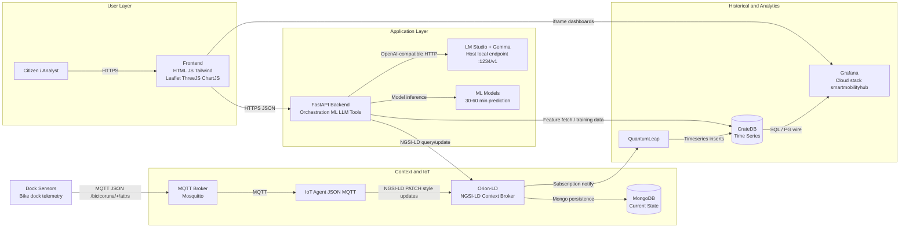

# Smart Mobility Hub - Architecture

Version: aligned with PRD v2.0
Pilot city: A Coruna
Approach: multi-city (city selected by context, not by duplicated infrastructure)

## 1) Technical description of each component

### 1.1 Orion-LD (Orion Context Broker, native NGSI-LD)
Orion-LD is the core context layer. It stores the latest state of entities and relationships in NGSI-LD format, including official types used by the hub:

- station_information (GBFSStation)
- station_status (GBFSStationStatus)
- free_bike_status (GBFSFreeBikeStatus)
- system_information (GBFSSystemInformation)
- geofencing_zones (GBFSGeofencingZone)
- BicycleParkingStation (MobilityStation)
- Trip
- Device
- WeatherObserved

Main responsibilities:

- Accept NGSI-LD create, update and query operations from IoT Agent and FastAPI.
- Keep relationships between entities (refStation, refOrigin, refDestination, refVehicle, refWeather, refDevice).
- Emit subscription notifications when relevant entities change.
- Serve as single source of current truth for realtime UX and LLM grounding.

Multi-city focus:

- City partitioning is logical, using attributes such as address.addressLocality and city-specific URNs.
- FastAPI and frontend pass locality filters so the same Orion instance can serve multiple cities.

### 1.2 IoT Agent MQTT (JSON) - MQTT topic to NGSI-LD mapping
IoT Agent receives telemetry from anchoring sensors via MQTT and translates payloads into context updates.

Expected topic pattern:

- /bicicoruna/+/attrs

Interpretation:

- + is the device identifier.
- attrs carries changing values such as numBikesAvailable.

Mapping logic:

- MQTT message is decoded as JSON.
- Device id from topic is mapped to a registered Device in IoT Agent.
- Attributes are transformed to NGSI-LD compatible fields and sent to Orion-LD as partial updates.
- Updates target station_status entities and/or linked Device entities, preserving refStation relationships.

Result:

- Sensor telemetry becomes NGSI-LD PATCH-like state updates in Orion-LD with low latency.

### 1.3 QuantumLeap + CrateDB - Orion notify subscription mechanism
QuantumLeap persists time evolution of context data as time series.

How it works:

- Orion-LD subscription is created for station_status changes.
- On every matching change, Orion sends notify payloads to QuantumLeap endpoint.
- QuantumLeap normalizes the notification and writes temporal rows in CrateDB.

Why this matters:

- Orion keeps current state.
- QuantumLeap + CrateDB keeps history for analytics, ML features, Grafana charts and sustainability metrics.

### 1.4 FastAPI backend - orchestration, ML serving and LLM function calling
FastAPI is the integration and business layer.

Responsibilities:

- Realtime API for frontend (station list, station detail, availability, predictions, route metadata, city switching).
- NGSI-LD query builder and adapter to Orion-LD.
- ML serving for 30/60 minute availability forecasts (using historical features from CrateDB and weather).
- LLM orchestration with function calling:
  - detect intent
  - query Orion with tool calls
  - inject grounded data into prompt
  - return response with explicit realtime vs prediction labels
- Optional bridge for Grafana panel embedding metadata.

Multi-city behavior:

- Each request carries city scope.
- FastAPI transforms city scope into NGSI-LD query filters (for example by addressLocality).

### 1.5 LM Studio + Gemma (local LLM) - host access from Docker
Gemma runs locally in LM Studio on host machine.

Container connectivity pattern:

- FastAPI runs in Docker.
- FastAPI uses LM_STUDIO_URL=http://host.docker.internal:1234/v1.
- host.docker.internal resolves host network from container runtime.

Operational flow:

- FastAPI builds grounded context via Orion queries.
- FastAPI sends prompt + structured facts to LM Studio OpenAI-compatible endpoint.
- Gemma returns natural language answer.
- FastAPI post-processes response to enforce policy labels and latency constraints.

### 1.6 Grafana Cloud (stack: smartmobilityhub) - CrateDB datasource and auto provisioning
Grafana is the analytics presentation layer.

Architecture option used here:

- Local Grafana container is provisioned automatically with a CrateDB datasource (PostgreSQL wire protocol on 5432).
- The same dashboard model can be published/imported in Grafana Cloud stack smartmobilityhub.

Provisioning behavior:

- Datasource file is mounted into /etc/grafana/provisioning/datasources/.
- On startup, Grafana reads datasource config with no manual UI setup.

Analytics outputs:

- City and station templated dashboards.
- Demand heatmaps, weather-demand correlation, redistribution risk, sustainability KPIs.

### 1.7 Static frontend (HTML + JS + Tailwind + Leaflet + ThreeJS + ChartJS)
Frontend is a static web app served by a lightweight web server.

Responsibilities:

- Multi-city selector with A Coruna as default pilot city.
- Realtime map and station cards from FastAPI endpoints.
- Prediction panels (30/60 min).
- 2D map interactions (Leaflet + OSM).
- Optional 3D city view (ThreeJS).
- Sustainability charts and counters (ChartJS).
- Embedded Grafana panels via iframe when needed.

### 1.8 MongoDB - Orion-LD internal persistence
MongoDB is the backing datastore for Orion-LD current context entities.

Responsibilities:

- Persist current entity documents and metadata used by Orion-LD.
- Support Orion restarts without losing current state.
- Separate concern from temporal history (which is in CrateDB via QuantumLeap).

---

## 2) Mermaid architecture diagram



---

## 3) Detailed data flow (critical section)

### 3.a IoT cycle: dock sensor MQTT -> IoT Agent -> Orion-LD
1. A dock sensor publishes telemetry to MQTT topic /bicicoruna/{deviceId}/attrs.
2. Protocol and format: MQTT + JSON payload, for example {"numBikesAvailable": 7, "lastReported": "2026-04-21T10:30:00Z"}.
3. Mosquitto forwards the message to subscribed IoT Agent JSON.
4. IoT Agent resolves deviceId from topic and validates service group and device mapping.
5. IoT Agent transforms mapped attributes into context update fields for station_status and/or Device.
6. IoT Agent sends HTTP update to Orion-LD.
7. Protocol and format on this hop: HTTP NGSI-LD update (partial update semantics, PATCH-like) with application/ld+json.
8. Orion-LD updates current entity state and keeps relationships (for example refStation) consistent.

### 3.b Historical cycle: Orion subscription notify -> QuantumLeap -> CrateDB
1. A station_status entity is updated in Orion-LD.
2. Orion checks active NGSI-LD subscriptions where entities.type equals station_status and watched attributes changed.
3. Orion emits notify request to QuantumLeap endpoint.
4. Protocol and format: HTTP POST with JSON notification payload to http://quantumleap:8668/v2/notify.
5. QuantumLeap parses entity id, type, changed attributes and timestamp.
6. QuantumLeap writes normalized time series points into CrateDB tables.
7. Protocol and format on storage hop: SQL inserts over CrateDB interface.
8. Result: historical timeline is available for Grafana dashboards and FastAPI ML pipelines.

### 3.c User API cycle: frontend request -> FastAPI -> Orion query -> JSON response
1. User selects city and opens map/dashboard in frontend.
2. Frontend sends HTTPS request to FastAPI, including city scope (for example addressLocality=A Coruna).
3. FastAPI builds NGSI-LD query with filters by entity type and locality.
4. FastAPI calls Orion-LD query endpoint.
5. Protocol and format on this hop: HTTP NGSI-LD query with Accept application/ld+json.
6. Orion returns entities in NGSI-LD JSON-LD.
7. FastAPI adapts payload to frontend contract (compact JSON), computing derived fields if needed.
8. Frontend renders map markers, station cards and warning states.

### 3.d LLM cycle: user message -> FastAPI function calling -> Orion -> Gemma/LM Studio -> answer
1. User writes a natural language question in frontend assistant.
2. Frontend sends message and city context to FastAPI.
3. FastAPI performs intent detection and chooses tools (function calling schema).
4. Tool execution step queries Orion-LD for realtime facts (station_status, station_information, WeatherObserved).
5. FastAPI builds grounded prompt containing:
   - user question
   - city scope
   - realtime facts
   - explicit flags for predicted vs realtime values
6. FastAPI sends prompt to LM Studio endpoint LM_STUDIO_URL.
7. Protocol and format: HTTP JSON request compatible with OpenAI-style chat/completions.
8. Gemma returns text answer.
9. FastAPI post-processes and returns final JSON response to frontend.

---

## 4) Network and ports table

| Service | Docker image | Internal port | External port | Access URL |
|---|---|---:|---:|---|
| orion-ld | fiware/orion-ld:1.6.0 | 1026 | 1026 | http://localhost:1026 |
| mongodb | mongo:6.0 | 27017 | 27017 | mongodb://localhost:27017 |
| iot-agent-mqtt | fiware/iotagent-json:3.4.0 | 4041 | 4041 | http://localhost:4041 |
| mosquitto | eclipse-mosquitto:2.0 | 1883 | 1883 | mqtt://localhost:1883 |
| quantumleap | orchestracities/quantumleap:0.9.0 | 8668 | 8668 | http://localhost:8668 |
| cratedb | crate:5.4.3 | 4200, 5432 | 4200, 5432 | http://localhost:4200 and postgresql://localhost:5432 |
| fastapi-backend | build ./backend/Dockerfile | 8000 | 8000 | http://localhost:8000 |
| grafana | grafana/grafana:10.2.0 | 3000 | 3000 | http://localhost:3000 |
| frontend | nginx:1.27-alpine | 80 | 8080 | http://localhost:8080 |

---

## 5) docker-compose.yml (complete and functional)

```yaml
version: "3.9"

networks:
  fiware_net:
    name: fiware_net
    driver: bridge

volumes:
  mongodb_data:
  cratedb_data:

services:
  mongodb:
    image: mongo:6.0
    container_name: mongodb
    restart: unless-stopped
    networks:
      - fiware_net
    ports:
      - "27017:27017"
    volumes:
      - mongodb_data:/data/db

  orion-ld:
    image: fiware/orion-ld:1.6.0
    container_name: orion-ld
    restart: unless-stopped
    depends_on:
      - mongodb
    networks:
      - fiware_net
    ports:
      - "1026:1026"
    command: >
      -dbhost mongodb
      -db mongold
      -logLevel INFO
      -corsOrigin __ALL
    healthcheck:
      test: ["CMD-SHELL", "curl -fsS http://localhost:1026/version >/dev/null || exit 1"]
      interval: 20s
      timeout: 5s
      retries: 10
      start_period: 20s

  mosquitto:
    image: eclipse-mosquitto:2.0
    container_name: mosquitto
    restart: unless-stopped
    networks:
      - fiware_net
    ports:
      - "1883:1883"
    volumes:
      - ./mosquitto/mosquitto.conf:/mosquitto/config/mosquitto.conf:ro

  iot-agent-mqtt:
    image: fiware/iotagent-json:3.4.0
    container_name: iot-agent-mqtt
    restart: unless-stopped
    depends_on:
      - orion-ld
      - mosquitto
    networks:
      - fiware_net
    ports:
      - "4041:4041"
    environment:
      IOTA_CB_HOST: orion-ld
      IOTA_CB_PORT: 1026
      IOTA_NORTH_PORT: 4041
      IOTA_HTTP_PORT: 7896
      IOTA_DEFAULT_RESOURCE: /iot/json
      IOTA_DEFAULT_TRANSPORT: MQTT
      IOTA_TIMESTAMP: "true"
      IOTA_MONGO_HOST: mongodb
      IOTA_MONGO_PORT: 27017
      IOTA_MONGO_DB: iotagentjson
      IOTA_MQTT_HOST: mosquitto
      IOTA_MQTT_PORT: 1883
      IOTA_MQTT_PROTOCOL: mqtt
      IOTA_PROVIDER_URL: http://iot-agent-mqtt:4041
      IOTA_LOG_LEVEL: INFO
    healthcheck:
      test: ["CMD-SHELL", "curl -fsS http://localhost:4041/iot/about >/dev/null || exit 1"]
      interval: 20s
      timeout: 5s
      retries: 10
      start_period: 20s

  cratedb:
    image: crate:5.4.3
    container_name: cratedb
    restart: unless-stopped
    networks:
      - fiware_net
    ports:
      - "4200:4200"
      - "5432:5432"
    volumes:
      - cratedb_data:/data
    command: >
      crate
      -Ccluster.name=smartmobilityhub
      -Cnode.name=crate01
      -Cpath.data=/data
      -Cauth.host_based.enabled=false
      -Ccluster.initial_master_nodes=crate01
    healthcheck:
      test: ["CMD-SHELL", "curl -fsS http://localhost:4200/_sql -H 'Content-Type: application/json' -d '{\"stmt\":\"SELECT 1\"}' >/dev/null || exit 1"]
      interval: 20s
      timeout: 5s
      retries: 15
      start_period: 40s

  quantumleap:
    image: orchestracities/quantumleap:0.9.0
    container_name: quantumleap
    restart: unless-stopped
    depends_on:
      - cratedb
      - orion-ld
    networks:
      - fiware_net
    ports:
      - "8668:8668"
    environment:
      CRATE_HOST: cratedb
      USE_GEOCODING: "False"
      LOGLEVEL: INFO

  fastapi-backend:
    build:
      context: ./backend
      dockerfile: Dockerfile
    container_name: fastapi-backend
    restart: unless-stopped
    depends_on:
      - orion-ld
      - quantumleap
      - cratedb
    networks:
      - fiware_net
    ports:
      - "8000:8000"
    environment:
      ORION_URL: http://orion-ld:1026
      QUANTUMLEAP_URL: http://quantumleap:8668
      CRATEDB_HTTP_URL: http://cratedb:4200
      CRATEDB_PG_HOST: cratedb
      CRATEDB_PG_PORT: 5432
      LM_STUDIO_URL: http://host.docker.internal:1234/v1

  grafana:
    image: grafana/grafana:10.2.0
    container_name: grafana
    restart: unless-stopped
    depends_on:
      - cratedb
    networks:
      - fiware_net
    ports:
      - "3000:3000"
    environment:
      GF_SECURITY_ADMIN_USER: admin
      GF_SECURITY_ADMIN_PASSWORD: admin
      GF_USERS_ALLOW_SIGN_UP: "false"
    volumes:
      - ./grafana/provisioning/datasources/cratedb.yml:/etc/grafana/provisioning/datasources/cratedb.yml:ro

  frontend:
    image: nginx:1.27-alpine
    container_name: frontend
    restart: unless-stopped
    depends_on:
      - fastapi-backend
    networks:
      - fiware_net
    ports:
      - "8080:80"
    volumes:
      - ./frontend:/usr/share/nginx/html:ro
```

### Grafana datasource provisioning file (mounted by compose)

Path in host project:

- ./grafana/provisioning/datasources/cratedb.yml

Example content:

```yaml
apiVersion: 1

datasources:
  - name: CrateDB
    type: postgres
    access: proxy
    url: cratedb:5432
    user: crate
    secureJsonData:
      password: ""
    jsonData:
      database: doc
      sslmode: disable
      postgresVersion: 1500
      timescaledb: false
    isDefault: true
    editable: true
```

---

## 6) IoT Agent configuration (service group + dock sensor devices)

### 6.1 Register service group

```json
{
  "services": [
    {
      "apikey": "bicicoruna",
      "cbroker": "http://orion-ld:1026",
      "entity_type": "station_status",
      "resource": "/bicicoruna"
    }
  ]
}
```

### 6.2 Register dock sensor devices

Topic policy used by devices:

- /bicicoruna/+/attrs

With this setup, each device publishes to:

- /bicicoruna/{device_id}/attrs

Example payload published by sensor:

```json
{
  "numBikesAvailable": 9,
  "lastReported": "2026-04-21T10:35:00Z"
}
```

Device registration example:

```json
{
  "devices": [
    {
      "device_id": "ACORUNA-001",
      "entity_name": "urn:ngsi-ld:station_status:acoruna:001",
      "entity_type": "station_status",
      "transport": "MQTT",
      "attributes": [
        {
          "object_id": "numBikesAvailable",
          "name": "num_bikes_available",
          "type": "Number"
        },
        {
          "object_id": "lastReported",
          "name": "last_reported",
          "type": "Text"
        }
      ],
      "static_attributes": [
        {
          "name": "refStation",
          "type": "Relationship",
          "value": "urn:ngsi-ld:station_information:acoruna:001"
        },
        {
          "name": "addressLocality",
          "type": "Text",
          "value": "A Coruna"
        }
      ]
    },
    {
      "device_id": "ACORUNA-002",
      "entity_name": "urn:ngsi-ld:station_status:acoruna:002",
      "entity_type": "station_status",
      "transport": "MQTT",
      "attributes": [
        {
          "object_id": "numBikesAvailable",
          "name": "num_bikes_available",
          "type": "Number"
        }
      ],
      "static_attributes": [
        {
          "name": "refStation",
          "type": "Relationship",
          "value": "urn:ngsi-ld:station_information:acoruna:002"
        },
        {
          "name": "addressLocality",
          "type": "Text",
          "value": "A Coruna"
        }
      ]
    }
  ]
}
```

Note for multi-city:

- Keep same topic convention per city namespace (for example /sevilla/+/attrs, /porto/+/attrs) or include city inside device id.
- Keep entity URNs and addressLocality aligned with city.

---

## 7) Orion-LD subscription config to QuantumLeap

NGSI-LD subscription (station_status -> QuantumLeap notify):

```json
{
  "id": "urn:ngsi-ld:Subscription:station-status-timeseries",
  "type": "Subscription",
  "entities": [
    {
      "type": "station_status"
    }
  ],
  "watchedAttributes": [
    "num_bikes_available",
    "num_docks_available",
    "last_reported"
  ],
  "q": "addressLocality==\"A Coruna\"",
  "notification": {
    "attributes": [
      "num_bikes_available",
      "num_docks_available",
      "last_reported",
      "refStation",
      "addressLocality"
    ],
    "endpoint": {
      "uri": "http://quantumleap:8668/v2/notify",
      "accept": "application/json"
    }
  },
  "throttling": 1,
  "@context": [
    "https://smartdatamodels.org/context.jsonld",
    "https://raw.githubusercontent.com/smart-data-models/dataModel.GBFS/master/context.jsonld"
  ]
}
```

Trigger condition used:

- Orion sends notify when one of watchedAttributes changes in station_status entities.

Multi-city recommendation:

- Use one subscription per city (q filter by addressLocality) or remove q and include city tag attribute so downstream analytics can segment by city.
