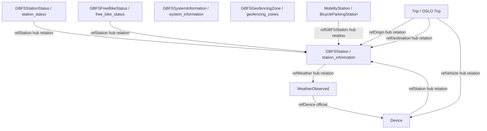

# Smart Mobility Hub Data Model

Pilot city: A Coruna

This document defines the NGSI-LD data model used by Smart Mobility Hub. It keeps the business names requested for the project and maps them to the official Smart Data Models or official OSLO application profiles.

## Scope and source policy

- Official source of truth is the Smart Data Models repository and the referenced official OSLO application profile for Trip.
- When a business name does not match the official entity name, the document keeps the business name and states the official type explicitly.
- For GBFS feeds, the official payload shape is feed oriented. In the hub, the station and bike identifiers are also materialized as NGSI-LD Relationships where the PRD requires them.
- Contexts are copied exactly from the official examples and specifications.

## Business name to official entity map

| Business name | Official type | Domain | Note |
|---|---|---|---|
| GBFSStation | station_information | dataModel.GBFS | Station master data and capacity |
| GBFSStationStatus | station_status | dataModel.GBFS | Real-time station availability |
| GBFSFreeBikeStatus | free_bike_status | dataModel.GBFS | Free-floating bike status |
| GBFSSystemInformation | system_information | dataModel.GBFS | System-level metadata |
| GBFSGeofencingZone | geofencing_zones | dataModel.GBFS | Operational geofencing rules |
| MobilityStation | BicycleParkingStation | dataModel.OSLO | Official OSLO equivalent used by Smart Data Models |
| Trip | Trip | OSLO Mobility Trips and Offerings AP | Official OSLO application profile, not the dataModel.OSLO repo |
| Device | Device | dataModel.Device | Cross-sector device entity |
| WeatherObserved | WeatherObserved | dataModel.Weather | Environmental observations |

## Relationship graph



## Common notes for GBFS feeds

The official GBFS entities in Smart Data Models are feed documents. Their top-level structure is usually:

- `id`: NGSI-LD identifier.
- `type`: entity type.
- `last_updated`: feed timestamp.
- `ttl`: refresh window in seconds.
- `version`: GBFS version.
- `data`: feed payload.

The PRD also requires station and bike references to be available as NGSI-LD Relationships in the hub integration layer. This document marks those as hub relations when they are not part of the official GBFS payload itself.

---

## GBFSStation

Official type: `station_information`

Official description: station master data for a bike-sharing station, including location, capacity and access metadata.

@context:

```json
[
  "https://smartdatamodels.org/context.jsonld",
  "https://raw.githubusercontent.com/smart-data-models/dataModel.GBFS/master/context.jsonld"
]
```

### Attributes

| Attribute | NGSI-LD type | Static or dynamic | Notes |
|---|---|---|---|
| id | Property | Static | Entity identifier |
| type | Property | Static | Must be `station_information` |
| last_updated | Property | Dynamic | Feed update timestamp |
| ttl | Property | Static | Feed refresh window |
| version | Property | Static | GBFS version |
| data | Property | Static | Wrapper object |
| data.stations[] | Property | Static | Array of stations |
| data.stations[].station_id | Property | Static | Station identifier |
| data.stations[].name | Property | Static | Public name |
| data.stations[].short_name | Property | Static | Optional short identifier |
| data.stations[].lat | Property | Static | Latitude |
| data.stations[].lon | Property | Static | Longitude |
| data.stations[].address | Property | Static | Street address |
| data.stations[].cross_street | Property | Static | Cross street or landmark |
| data.stations[].region_id | Property | Static | Region identifier |
| data.stations[].post_code | Property | Static | Postal code |
| data.stations[].capacity | Property | Static | Total docking points |
| data.stations[].is_valet_station | Property | Static | Valet service flag |
| data.stations[].is_virtual_station | Property | Static | Virtual station flag |
| data.stations[].station_area | GeoProperty | Static | GeoJSON MultiPolygon for virtual station area |
| data.stations[].rental_methods | Property | Static | Payment methods accepted |
| data.stations[].rental_uris | Property | Static | Android / iOS / web rental URIs |
| data.stations[].vehicle_capacity | Property | Static | Per vehicle type capacity inside station area |
| data.stations[].vehicle_type_capacity | Property | Static | Per vehicle type docking points installed |
| refWeather | Relationship | Dynamic | Hub relation to the latest WeatherObserved covering the station area |

Integration note for correction and ingestion in the hub:

- `GBFSStation` (`station_information`) is modeled as one feed entity that contains all city stations in `data.stations[]`.
- In the integration layer, each station is handled and referenced by its `data.stations[].station_id` value.
- Therefore, `station_id` is the station-level key inside the feed array, not a standalone NGSI-LD entity id by itself.

### Example JSON-LD

```json
{
  "id": "urn:ngsi-ld:station_information:acoruna:bicicoruna",
  "type": "station_information",
  "last_updated": 1774003200,
  "ttl": 30,
  "version": "3.0",
  "data": {
    "stations": [
      {
        "station_id": "ACORUNA-001",
        "name": "Praza de Maria Pita",
        "short_name": "Maria Pita",
        "lat": 43.3709,
        "lon": -8.3956,
        "address": "Praza de Maria Pita, A Coruna",
        "cross_street": "Av. de la Marina",
        "region_id": "acoruna-centro",
        "post_code": "15001",
        "capacity": 20,
        "is_valet_station": false,
        "is_virtual_station": false,
        "station_area": {
          "type": "MultiPolygon",
          "coordinates": [
            [
              [
                [-8.3960, 43.3712],
                [-8.3951, 43.3712],
                [-8.3951, 43.3706],
                [-8.3960, 43.3706],
                [-8.3960, 43.3712]
              ]
            ]
          ]
        },
        "rental_methods": ["phone", "creditcard"],
        "rental_uris": {
          "android": "https://bicicoruna.example.com/rent/android",
          "ios": "https://bicicoruna.example.com/rent/ios",
          "web": "https://bicicoruna.example.com/rent"
        },
        "vehicle_capacity": {
          "regular bike": 18
        },
        "vehicle_type_capacity": {
          "regular bike": 20
        }
      }
    ]
  },
  "refWeather": {
    "type": "Relationship",
    "object": "urn:ngsi-ld:WeatherObserved:acoruna:marina-001"
  },
  "@context": [
    "https://smartdatamodels.org/context.jsonld",
    "https://raw.githubusercontent.com/smart-data-models/dataModel.GBFS/master/context.jsonld"
  ]
}
```

---

## GBFSStationStatus

Official type: `station_status`

Official description: real-time capacity and rental availability for each station.

@context:

```json
[
  "https://smartdatamodels.org/context.jsonld",
  "https://raw.githubusercontent.com/smart-data-models/dataModel.GBFS/master/context.jsonld"
]
```

### Attributes

| Attribute | NGSI-LD type | Static or dynamic | Notes |
|---|---|---|---|
| id | Property | Static | Entity identifier |
| type | Property | Static | Must be `station_status` |
| last_updated | Property | Dynamic | Feed update timestamp |
| ttl | Property | Static | Feed refresh window |
| version | Property | Static | GBFS version |
| data | Property | Dynamic | Wrapper object |
| data.stations[] | Property | Dynamic | Array of station status objects |
| data.stations[].station_id | Property | Static | Station identifier |
| data.stations[].is_installed | Property | Dynamic | Station present on street |
| data.stations[].is_renting | Property | Dynamic | Renting enabled |
| data.stations[].is_returning | Property | Dynamic | Returns enabled |
| data.stations[].last_reported | Property | Dynamic | Last backend report time |
| data.stations[].num_bikes_available | Property | Dynamic | Available vehicles |
| data.stations[].num_bikes_disabled | Property | Dynamic | Disabled vehicles |
| data.stations[].num_docks_available | Property | Dynamic | Available docks |
| data.stations[].num_docks_disabled | Property | Dynamic | Disabled docks |
| data.stations[].vehicle_docks_available | Property | Dynamic | Per vehicle type dock availability |
| data.stations[].vehicle_docks_available[].vehicle_type_ids | Property | Dynamic | Vehicle type ids |
| data.stations[].vehicle_docks_available[].count | Property | Dynamic | Count per dock group |
| data.stations[].vehicle_types_available | Property | Dynamic | Per vehicle type availability |
| data.stations[].vehicle_types_available[].vehicle_type_id | Property | Dynamic | Vehicle type id |
| data.stations[].vehicle_types_available[].count | Property | Dynamic | Count per vehicle type |
| refStation | Relationship | Dynamic | Hub relation to GBFSStation |

### Example JSON-LD

```json
{
  "id": "urn:ngsi-ld:station_status:acoruna:bicicoruna",
  "type": "station_status",
  "last_updated": 1774003230,
  "ttl": 30,
  "version": "3.0",
  "data": {
    "stations": [
      {
        "station_id": "ACORUNA-001",
        "is_installed": true,
        "is_renting": true,
        "is_returning": true,
        "last_reported": 1774003230,
        "num_bikes_available": 6,
        "num_bikes_disabled": 0,
        "num_docks_available": 10,
        "num_docks_disabled": 0,
        "vehicle_docks_available": [
          {
            "vehicle_type_ids": ["regular bike"],
            "count": 10
          }
        ],
        "vehicle_types_available": [
          {
            "vehicle_type_id": "regular bike",
            "count": 6
          }
        ]
      }
    ]
  },
  "refStation": {
    "type": "Relationship",
    "object": "urn:ngsi-ld:station_information:acoruna:bicicoruna"
  },
  "@context": [
    "https://smartdatamodels.org/context.jsonld",
    "https://raw.githubusercontent.com/smart-data-models/dataModel.GBFS/master/context.jsonld"
  ]
}
```

---

## GBFSFreeBikeStatus

Official type: `free_bike_status`

Official description: available vehicles that are not tied to a fixed station.

@context:

```json
[
  "https://smartdatamodels.org/context.jsonld",
  "https://raw.githubusercontent.com/smart-data-models/dataModel.GBFS/master/context.jsonld"
]
```

### Attributes

| Attribute | NGSI-LD type | Static or dynamic | Notes |
|---|---|---|---|
| id | Property | Static | Entity identifier |
| type | Property | Static | Must be `free_bike_status` |
| last_updated | Property | Dynamic | Feed update timestamp |
| ttl | Property | Static | Feed refresh window |
| version | Property | Static | GBFS version |
| data | Property | Dynamic | Wrapper object |
| data.bikes[] | Property | Dynamic | Array of bike objects |
| data.bikes[].bike_id | Property | Static | Rotating vehicle identifier |
| data.bikes[].lat | Property | Dynamic | Latitude |
| data.bikes[].lon | Property | Dynamic | Longitude |
| data.bikes[].is_reserved | Property | Dynamic | Reserved flag |
| data.bikes[].is_disabled | Property | Dynamic | Disabled flag |
| data.bikes[].rental_uris | Property | Static | Rental URIs |
| data.bikes[].rental_uris.android | Property | Static | Android deep link |
| data.bikes[].rental_uris.ios | Property | Static | iOS deep link |
| data.bikes[].rental_uris.web | Property | Static | Web link |
| data.bikes[].vehicle_type_id | Property | Static | Vehicle type id |
| data.bikes[].last_reported | Property | Dynamic | Last report time |
| data.bikes[].current_range_meters | Property | Dynamic | Remaining range |
| data.bikes[].station_id | Property | Dynamic | Station identifier when docked |
| data.bikes[].pricing_plan_id | Property | Static | Pricing plan identifier |
| refStation | Relationship | Dynamic | Hub relation to GBFSStation when a bike is docked |

### Example JSON-LD

```json
{
  "id": "urn:ngsi-ld:free_bike_status:acoruna:bicicoruna",
  "type": "free_bike_status",
  "last_updated": 1774003230,
  "ttl": 30,
  "version": "3.0-RC",
  "data": {
    "bikes": [
      {
        "bike_id": "ACORUNA-BIKE-0142",
        "lat": 43.3713,
        "lon": -8.3962,
        "is_reserved": false,
        "is_disabled": false,
        "rental_uris": {
          "android": "https://bicicoruna.example.com/bike/ACORUNA-BIKE-0142/android",
          "ios": "https://bicicoruna.example.com/bike/ACORUNA-BIKE-0142/ios",
          "web": "https://bicicoruna.example.com/bike/ACORUNA-BIKE-0142"
        },
        "vehicle_type_id": "regular bike",
        "last_reported": 1774003230,
        "current_range_meters": 14600,
        "station_id": "ACORUNA-001",
        "pricing_plan_id": "basic-day-pass"
      }
    ]
  },
  "refStation": {
    "type": "Relationship",
    "object": "urn:ngsi-ld:station_information:acoruna:bicicoruna"
  },
  "@context": [
    "https://smartdatamodels.org/context.jsonld",
    "https://raw.githubusercontent.com/smart-data-models/dataModel.GBFS/master/context.jsonld"
  ]
}
```

---

## GBFSSystemInformation

Official type: `system_information`

Official description: metadata of the shared mobility system and its feed.

@context:

```json
[
  "https://smartdatamodels.org/context.jsonld",
  "https://raw.githubusercontent.com/smart-data-models/dataModel.GBFS/master/context.jsonld"
]
```

### Attributes

| Attribute | NGSI-LD type | Static or dynamic | Notes |
|---|---|---|---|
| id | Property | Static | Entity identifier |
| type | Property | Static | Must be `system_information` |
| last_updated | Property | Dynamic | Feed update timestamp |
| ttl | Property | Static | Feed refresh window |
| version | Property | Static | GBFS version |
| data | Property | Static | Wrapper object |
| data.system_id | Property | Static | Unique system id |
| data.language | Property | Static | Feed language |
| data.name | Property | Static | Public system name |
| data.short_name | Property | Static | Short name |
| data.operator | Property | Static | Operator name |
| data.url | Property | Static | System URL |
| data.purchase_url | Property | Static | Membership purchase URL |
| data.start_date | Property | Static | System start date |
| data.phone_number | Property | Static | Voice contact number |
| data.email | Property | Static | Customer service email |
| data.feed_contact_email | Property | Static | Technical feed contact email |
| data.timezone | Property | Static | System timezone |
| data.license_url | Property | Static | License URL |
| data.brand_assets | Property | Static | Brand metadata object |
| data.brand_assets.brand_last_modified | Property | Static | Brand assets update date |
| data.brand_assets.brand_image_url | Property | Static | Brand image |
| data.brand_assets.brand_image_url_dark | Property | Static | Dark brand image |
| data.brand_assets.color | Property | Static | Brand color |
| data.brand_assets.terms_url | Property | Static | Terms URL |
| data.rental_apps | Property | Static | Rental app metadata object |
| data.rental_apps.android.store_uri | Property | Static | Android app store URI |
| data.rental_apps.android.discovery_uri | Property | Static | Android app discovery URI |
| data.rental_apps.ios.store_uri | Property | Static | iOS app store URI |
| data.rental_apps.ios.discovery_uri | Property | Static | iOS app discovery URI |

### Example JSON-LD

```json
{
  "id": "urn:ngsi-ld:system_information:acoruna:bicicoruna",
  "type": "system_information",
  "last_updated": 1774003200,
  "ttl": 86400,
  "version": "3.0",
  "data": {
    "system_id": "bicicoruna-acoruna",
    "language": "es",
    "name": "BiciCoruna",
    "short_name": "BiciCoruna",
    "operator": "Concello da Coruna",
    "url": "https://bicicoruna.example.com",
    "purchase_url": "https://bicicoruna.example.com/membership",
    "start_date": "2026-03-01",
    "phone_number": "+34 900 000 001",
    "email": "atencion@bicicoruna.example.com",
    "feed_contact_email": "feeds@bicicoruna.example.com",
    "timezone": "Europe/Madrid",
    "license_url": "https://bicicoruna.example.com/legal/license",
    "brand_assets": {
      "brand_last_modified": "2026-03-01",
      "brand_image_url": "https://bicicoruna.example.com/assets/brand.svg",
      "brand_image_url_dark": "https://bicicoruna.example.com/assets/brand-dark.svg",
      "color": "#0057B8",
      "terms_url": "https://bicicoruna.example.com/legal/terms"
    },
    "rental_apps": {
      "android": {
        "store_uri": "https://play.google.com/store/apps/details?id=es.bicicoruna.app",
        "discovery_uri": "https://bicicoruna.example.com/app/android/discover"
      },
      "ios": {
        "store_uri": "https://apps.apple.com/app/id0000000000",
        "discovery_uri": "https://bicicoruna.example.com/app/ios/discover"
      }
    }
  },
  "@context": [
    "https://smartdatamodels.org/context.jsonld",
    "https://raw.githubusercontent.com/smart-data-models/dataModel.GBFS/master/context.jsonld"
  ]
}
```

---

## GBFSGeofencingZone

Official type: `geofencing_zones`

Official description: geofencing polygons and their ride rules.

@context:

```json
[
  "https://smartdatamodels.org/context.jsonld",
  "https://raw.githubusercontent.com/smart-data-models/dataModel.GBFS/master/context.jsonld"
]
```

### Attributes

| Attribute | NGSI-LD type | Static or dynamic | Notes |
|---|---|---|---|
| id | Property | Static | Entity identifier |
| type | Property | Static | Must be `geofencing_zones` |
| last_updated | Property | Dynamic | Feed update timestamp |
| ttl | Property | Static | Feed refresh window |
| version | Property | Static | GBFS version |
| data | Property | Static | Wrapper object |
| data.geofencing_zones.features[] | Property | Static | GeoJSON Feature array |
| data.geofencing_zones.features[].type | Property | Static | Must be `Feature` |
| data.geofencing_zones.features[].geometry | GeoProperty | Static | GeoJSON MultiPolygon |
| data.geofencing_zones.features[].properties | Property | Static | Rule container |
| data.geofencing_zones.features[].properties.name | Property | Static | Zone name |
| data.geofencing_zones.features[].properties.start | Property | Dynamic | Activation time |
| data.geofencing_zones.features[].properties.end | Property | Dynamic | Deactivation time |
| data.geofencing_zones.features[].properties.rules[] | Property | Static | Rule array |
| data.geofencing_zones.features[].properties.rules[].vehicle_type_id | Property | Static | Vehicle type ids |
| data.geofencing_zones.features[].properties.rules[].ride_allowed | Property | Static | Ride allowed flag |
| data.geofencing_zones.features[].properties.rules[].ride_through_allowed | Property | Static | Ride-through allowed flag |
| data.geofencing_zones.features[].properties.rules[].maximum_speed_kph | Property | Static | Max speed |

### Example JSON-LD

```json
{
  "id": "urn:ngsi-ld:geofencing_zones:acoruna:bicicoruna",
  "type": "geofencing_zones",
  "last_updated": 1774003200,
  "ttl": 300,
  "version": "3.0",
  "data": {
    "geofencing_zones": {
      "features": [
        {
          "type": "Feature",
          "geometry": {
            "type": "MultiPolygon",
            "coordinates": [
              [
                [
                  [-8.4095, 43.3770],
                  [-8.3880, 43.3770],
                  [-8.3880, 43.3610],
                  [-8.4095, 43.3610],
                  [-8.4095, 43.3770]
                ]
              ]
            ]
          },
          "properties": {
            "name": "A Coruna historic center restriction",
            "start": 1774003200,
            "end": 1774089600,
            "rules": [
              {
                "vehicle_type_id": ["regular bike"],
                "ride_allowed": true,
                "ride_through_allowed": true,
                "maximum_speed_kph": 15
              }
            ]
          }
        }
      ]
    }
  },
  "@context": [
    "https://smartdatamodels.org/context.jsonld",
    "https://raw.githubusercontent.com/smart-data-models/dataModel.GBFS/master/context.jsonld"
  ]
}
```

---

## MobilityStation

Official type: `BicycleParkingStation`

Official description: bicycle parking station used as the OSLO equivalent in Smart Data Models.

@context:

```json
[
  "https://uri.etsi.org/ngsi-ld/v1/ngsi-ld-core-context.jsonld",
  "https://raw.githubusercontent.com/smart-data-models/dataModel.OSLO/master/context.jsonld"
]
```

### Attributes

| Attribute | NGSI-LD type | Static or dynamic | Notes |
|---|---|---|---|
| id | Property | Static | Entity identifier |
| type | Property | Static | Must be `BicycleParkingStation` |
| ParkingFacility.capacity | Property | Static | Capacity object |
| ParkingFacility.capacity.Capacity.total | Property | Static | Total capacity |
| InfrastructureElement.geometry | Property | Static | Geometry object with WKT |
| InfrastructureElement.geometry.Geometry.asWkt | Property | Static | WKT geometry |
| location | GeoProperty | Static | GeoJSON point |
| address | Property | Static | Postal address |
| address.addressCountry | Property | Static | Country |
| address.addressLocality | Property | Static | Locality |
| address.addressRegion | Property | Static | Region |
| address.streetAddress | Property | Static | Street address |
| address.postalCode | Property | Static | Postal code |
| refGBFSStation | Relationship | Static | Hub relation to GBFSStation |

### Example JSON-LD

```json
{
  "id": "urn:ngsi-ld:BicycleParkingStation:acoruna:001",
  "type": "BicycleParkingStation",
  "ParkingFacility.capacity": {
    "type": "Capacity",
    "Capacity.total": 20
  },
  "InfrastructureElement.geometry": {
    "type": "Geometry",
    "Geometry.asWkt": "POINT(-8.3956 43.3709)"
  },
  "location": {
    "type": "Point",
    "coordinates": [-8.3956, 43.3709]
  },
  "address": {
    "addressCountry": "ES",
    "addressLocality": "A Coruna",
    "addressRegion": "Galicia",
    "streetAddress": "Praza de Maria Pita",
    "postalCode": "15001"
  },
  "refGBFSStation": {
    "type": "Relationship",
    "object": "urn:ngsi-ld:station_information:acoruna:bicicoruna"
  },
  "@context": [
    "https://uri.etsi.org/ngsi-ld/v1/ngsi-ld-core-context.jsonld",
    "https://raw.githubusercontent.com/smart-data-models/dataModel.OSLO/master/context.jsonld"
  ]
}
```

---

## Trip

Official type: `Trip` from the OSLO Mobility Trips and Offerings application profile.

Official description: voluntary movement from one location to another.

Official context:

```json
[
  "https://data.vlaanderen.be/doc/applicatieprofiel/mobiliteit-trips-en-aanbod/erkendestandaard/2020-04-23/context/mobiliteit-trips-en-aanbod-ap.jsonld"
]
```

### Attributes

| Attribute | NGSI-LD type | Static or dynamic | Notes |
|---|---|---|---|
| id | Property | Static | Entity identifier |
| type | Property | Static | Must be `Trip` |
| arrivalTime | Property | Dynamic | Trip arrival time |
| departureTime | Property | Dynamic | Trip departure time |
| chosenRoute | Relationship | Dynamic | Chosen route |
| executedRoute | Relationship | Dynamic | Executed route |
| itinerary | Relationship | Dynamic | Ordered locations to visit |
| partOfTrip | Relationship | Dynamic | Trip hierarchy |
| possibleRoute | Relationship | Static | Possible route options |
| booking | Relationship | Static | Booking reference |
| transportDocument | Relationship | Static | Travel document reference |
| refOrigin | Relationship | Dynamic | Hub relation to origin station |
| refDestination | Relationship | Dynamic | Hub relation to destination station |
| refVehicle | Relationship | Dynamic | Hub relation to Device for the bike in use |

### Example JSON-LD

```json
{
  "id": "urn:ngsi-ld:Trip:acoruna:20260421-0001",
  "type": "Trip",
  "departureTime": "2026-04-21T08:15:00Z",
  "arrivalTime": "2026-04-21T08:31:00Z",
  "chosenRoute": {
    "type": "Relationship",
    "object": "urn:ngsi-ld:Route:acoruna:marina-maria-pita"
  },
  "executedRoute": {
    "type": "Relationship",
    "object": "urn:ngsi-ld:Route:acoruna:marina-maria-pita"
  },
  "itinerary": {
    "type": "Relationship",
    "object": "urn:ngsi-ld:Location:acoruna:marina"
  },
  "partOfTrip": {
    "type": "Relationship",
    "object": "urn:ngsi-ld:Trip:acoruna:20260421"
  },
  "possibleRoute": {
    "type": "Relationship",
    "object": "urn:ngsi-ld:Route:acoruna:coastal-01"
  },
  "booking": {
    "type": "Relationship",
    "object": "urn:ngsi-ld:Booking:acoruna:20260421-0001"
  },
  "transportDocument": {
    "type": "Relationship",
    "object": "urn:ngsi-ld:Ticket:acoruna:20260421-0001"
  },
  "refOrigin": {
    "type": "Relationship",
    "object": "urn:ngsi-ld:station_information:acoruna:bicicoruna"
  },
  "refDestination": {
    "type": "Relationship",
    "object": "urn:ngsi-ld:station_information:acoruna:torre-hercules"
  },
  "refVehicle": {
    "type": "Relationship",
    "object": "urn:ngsi-ld:Device:acoruna:bike-gps-0142"
  },
  "@context": [
    "https://data.vlaanderen.be/doc/applicatieprofiel/mobiliteit-trips-en-aanbod/erkendestandaard/2020-04-23/context/mobiliteit-trips-en-aanbod-ap.jsonld"
  ]
}
```

---

## Device

Official type: `Device`

Official description: hardware plus software entity used as sensor, actuator, meter or network device.

@context:

```json
[
  "https://raw.githubusercontent.com/smart-data-models/dataModel.Device/master/context.jsonld"
]
```

### Attributes

| Attribute | NGSI-LD type | Static or dynamic | Notes |
|---|---|---|---|
| id | Property | Static | Entity identifier |
| type | Property | Static | Must be `Device` |
| address | Property | Static | Postal address |
| address.addressCountry | Property | Static | Country |
| address.addressLocality | Property | Static | Locality |
| address.addressRegion | Property | Static | Region |
| areaServed | Property | Static | Service area |
| batteryLevel | Property | Dynamic | Battery state |
| category | Property | Static | Device category array |
| controlledProperty | Property | Static | What the device senses or controls |
| dataProvider | Property | Static | Source/provider |
| dateCreated | Property | Static | Entity creation timestamp |
| dateModified | Property | Dynamic | Last modification timestamp |
| dateObserved | Property | Dynamic | User-defined observation time |
| dateInstalled | Property | Static | Installation time |
| dateLastCalibration | Property | Static | Last calibration time |
| dateLastValueReported | Property | Dynamic | Last successful report |
| dateManufactured | Property | Static | Manufacture timestamp |
| depth | Property | Static | Depth-based placement |
| description | Property | Static | Free description |
| deviceCategory | Property | Static | Category of device |
| deviceState | Property | Dynamic | Operational state |
| direction | Property | Static | Inlet / Outlet / Entry / Exit |
| distance | Property | Static | Distance-based placement |
| dstAware | Property | Static | Daylight savings awareness |
| firmwareVersion | Property | Static | Firmware version |
| hardwareVersion | Property | Static | Hardware version |
| location | GeoProperty | Static | Geographic position |
| manufacturerName | Property | Static | Manufacturer name |
| model | Property | Static | Model reference |
| modelName | Property | Static | Model name |
| owner | Property | Static | Owner(s) |
| refDeviceModel | Relationship | Static | Reference to DeviceModel |
| rssi | Property | Dynamic | Signal strength |
| serialNumber | Property | Static | Serial number |
| softwareVersion | Property | Static | Software version |
| source | Property | Static | Original source URL |
| supportedProtocol | Property | Static | Supported protocols |
| controlledAsset | Relationship | Static | Asset controlled by the device |
| refStation | Relationship | Dynamic | Hub relation to GBFSStation |

### Example JSON-LD

```json
{
  "id": "urn:ngsi-ld:Device:acoruna:bike-gps-0142",
  "type": "Device",
  "controlledProperty": ["location"],
  "deviceCategory": ["sensor"],
  "serialNumber": "GPS-ACORUNA-0142",
  "hardwareVersion": "1.0",
  "softwareVersion": "2.4.1",
  "firmwareVersion": "1.8.0",
  "batteryLevel": 0.83,
  "deviceState": "ok",
  "dateInstalled": "2026-03-01T09:00:00Z",
  "dateLastCalibration": "2026-04-10T10:00:00Z",
  "dateLastValueReported": "2026-04-21T08:15:20Z",
  "location": {
    "type": "Point",
    "coordinates": [-8.3962, 43.3713]
  },
  "refStation": {
    "type": "Relationship",
    "object": "urn:ngsi-ld:station_information:acoruna:bicicoruna"
  },
  "refDeviceModel": {
    "type": "Relationship",
    "object": "urn:ngsi-ld:DeviceModel:bike-gps-tracker-v1"
  },
  "@context": [
    "https://raw.githubusercontent.com/smart-data-models/dataModel.Device/master/context.jsonld"
  ]
}
```

---

## WeatherObserved

Official type: `WeatherObserved`

Official description: weather observation for a place and time.

@context:

```json
[
  "https://smart-data-models.github.io/dataModel.Weather/context.jsonld",
  "https://raw.githubusercontent.com/smart-data-models/dataModel.Weather/master/context.jsonld"
]
```

### Attributes

| Attribute | NGSI-LD type | Static or dynamic | Notes |
|---|---|---|---|
| id | Property | Static | Entity identifier |
| type | Property | Static | Must be `WeatherObserved` |
| dateObserved | Property | Dynamic | Observation timestamp |
| location | GeoProperty | Static | Observation point |
| address | Property | Static | Mailing address |
| address.addressCountry | Property | Static | Country |
| address.addressLocality | Property | Static | Locality |
| address.addressRegion | Property | Static | Region |
| altitude | Property | Static | Altitude |
| atmosphericPressure | Property | Dynamic | Pressure in hPa |
| dataProvider | Property | Static | Data provider |
| dateCreated | Property | Static | Creation timestamp |
| dateModified | Property | Dynamic | Modification timestamp |
| description | Property | Static | Description |
| dewPoint | Property | Dynamic | Dew point |
| diffuseIrradiation | Property | Dynamic | Diffuse radiation |
| directIrradiation | Property | Dynamic | Direct radiation |
| illuminance | Property | Dynamic | Light intensity |
| precipitation | Property | Dynamic | Rain amount |
| pressureTendency | Property | Dynamic | Pressure tendency |
| refDevice | Relationship | Dynamic | Official relation to Device |
| refPointOfInterest | Relationship | Static | POI reference |
| relativeHumidity | Property | Dynamic | Relative humidity |
| relativeHumidityForecast | Property | Dynamic | Forecast humidity |
| snowHeight | Property | Dynamic | Snow height |
| solarRadiation | Property | Dynamic | Solar radiation |
| source | Property | Static | Source URL |
| streamGauge | Property | Dynamic | Stream gauge |
| temperature | Property | Dynamic | Air temperature |
| uVIndex | Property | Dynamic | UV index |
| uVIndexMax | Property | Dynamic | Maximum UV index |
| visibility | Property | Dynamic | Visibility category or range |
| weatherType | Property | Dynamic | Text weather type |
| windDirection | Property | Dynamic | Wind direction |
| windSpeed | Property | Dynamic | Wind speed |

### Example JSON-LD

```json
{
  "id": "urn:ngsi-ld:WeatherObserved:acoruna:marina-001",
  "type": "WeatherObserved",
  "dateObserved": "2026-04-21T08:15:00Z",
  "location": {
    "type": "Point",
    "coordinates": [-8.3932, 43.3718]
  },
  "address": {
    "addressCountry": "ES",
    "addressLocality": "A Coruna",
    "addressRegion": "Galicia"
  },
  "dataProvider": "AEMET",
  "source": "https://www.aemet.es",
  "temperature": 14.8,
  "relativeHumidity": 0.79,
  "atmosphericPressure": 1017.4,
  "precipitation": 0.2,
  "windSpeed": 9.6,
  "windDirection": 310,
  "pressureTendency": 0.1,
  "illuminance": 3400,
  "dewPoint": 11.2,
  "uVIndexMax": 2.0,
  "visibility": "good",
  "weatherType": "cloudy",
  "refDevice": {
    "type": "Relationship",
    "object": "urn:ngsi-ld:Device:acoruna:meteo-sensor-01"
  },
  "@context": [
    "https://smart-data-models.github.io/dataModel.Weather/context.jsonld",
    "https://raw.githubusercontent.com/smart-data-models/dataModel.Weather/master/context.jsonld"
  ]
}
```

---

## Hub-level ref summary

The following relationships are used at the Smart Mobility Hub integration layer:

| From | Relationship | To | Origin |
|---|---|---|---|
| GBFSStationStatus | refStation | GBFSStation | Hub integration |
| GBFSFreeBikeStatus | refStation | GBFSStation | Hub integration |
| MobilityStation | refGBFSStation | GBFSStation | Hub integration |
| Trip | refOrigin | GBFSStation | Hub integration |
| Trip | refDestination | GBFSStation | Hub integration |
| Trip | refVehicle | Device | Hub integration |
| GBFSStation | refWeather | WeatherObserved | Hub integration |
| Device | refStation | GBFSStation | Hub integration |
| WeatherObserved | refDevice | Device | Official WeatherObserved relation |

## Pilot city notes for A Coruna

- Use coordinates around `43.36-43.38` latitude and `-8.41 to -8.38` longitude.
- Treat wind as the main weather factor for prediction and planning.
- Keep `last_updated` and `last_reported` values realistic and close to observation time.
- Use `Europe/Madrid` timezone in system metadata.

## Source traceability

- GBFS entities: Smart Data Models dataModel.GBFS documentation and examples.
- OSLO station model: Smart Data Models dataModel.OSLO BicycleParkingStation.
- Trip: official OSLO Mobility Trips and Offerings application profile.
- Device: Smart Data Models dataModel.Device.
- WeatherObserved: Smart Data Models dataModel.Weather.
