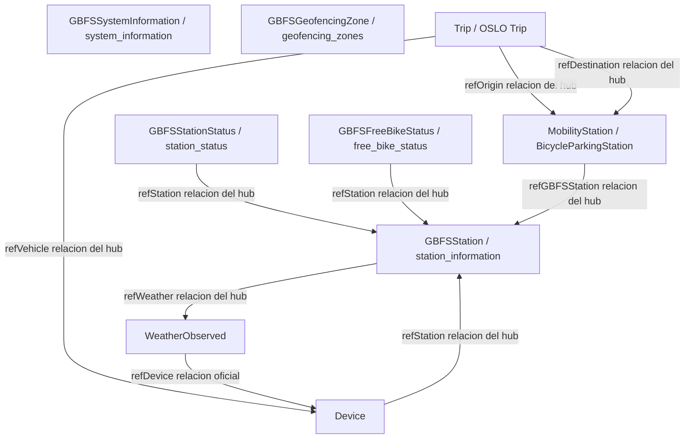

# Modelo de datos de Smart Mobility Hub

Ciudad piloto: A Coruna

Este documento define el modelo de datos NGSI-LD utilizado por Smart Mobility Hub. Conserva los nombres de negocio solicitados para el proyecto y los vincula con los modelos oficiales de Smart Data Models o con los perfiles oficiales de aplicacion de OSLO.

## Alcance y politica de fuentes

- La fuente de verdad oficial es el repositorio de Smart Data Models y el perfil oficial de aplicacion de OSLO referido para `Trip`.
- Cuando un nombre de negocio no coincide con el nombre oficial de la entidad, el documento mantiene el nombre de negocio e indica explicitamente el tipo oficial.
- Para los feeds GBFS, la estructura oficial del payload es orientada a feed. En el hub, los identificadores de estaciones y bicicletas tambien se materializan como relaciones NGSI-LD cuando el PRD lo requiere.
- Los contextos se copian exactamente de los ejemplos y especificaciones oficiales.
- Las salidas de prediccion (30/60 min) son analitica derivada producida por el ML del backend y no se modelan como entidades NGSI-LD adicionales.

## Mapa de nombres de negocio a entidad oficial

| Nombre de negocio | Tipo oficial | Dominio | Nota |
|---|---|---|---|
| GBFSStation | station_information | dataModel.GBFS | Datos maestros de la estacion y capacidad |
| GBFSStationStatus | station_status | dataModel.GBFS | Disponibilidad de la estacion en tiempo real por estacion |
| GBFSFreeBikeStatus | free_bike_status | dataModel.GBFS | Estado de bicicleta libre o flotante |
| GBFSSystemInformation | system_information | dataModel.GBFS | Metadatos a nivel de sistema |
| GBFSGeofencingZone | geofencing_zones | dataModel.GBFS | Reglas operativas de geovallado |
| MobilityStation | BicycleParkingStation | dataModel.OSLO | Equivalente oficial de OSLO usado por Smart Data Models |
| Trip | Trip | OSLO Mobility Trips and Offerings AP | Perfil oficial de aplicacion de OSLO, no el repositorio dataModel.OSLO |
| Device | Device | dataModel.Device | Entidad de dispositivo de sector transversal |
| WeatherObserved | WeatherObserved | dataModel.Weather | Observaciones ambientales |

## Grafo de relaciones



## Notas comunes para feeds GBFS

Las entidades GBFS oficiales en Smart Data Models son documentos de feed. Su estructura de primer nivel suele ser:

- `id`: identificador NGSI-LD.
- `type`: tipo de entidad.
- `last_updated`: marca temporal del feed.
- `ttl`: ventana de refresco en segundos.
- `version`: version GBFS.
- `data`: carga util del feed.

El PRD tambien exige que las referencias a estaciones y bicicletas esten disponibles como relaciones NGSI-LD en la capa de integracion del hub. Este documento las marca como relaciones del hub cuando no forman parte de la carga util oficial del GBFS.

---

## GBFSStation

Tipo oficial: `station_information`

Descripcion oficial: datos maestros de una estacion de bicicleta compartida, incluyendo ubicacion, capacidad y metadatos de acceso.

@context:

```json
[
  "https://smartdatamodels.org/context.jsonld",
  "https://raw.githubusercontent.com/smart-data-models/dataModel.GBFS/master/context.jsonld"
]
```

### Atributos

| Atributo | Tipo NGSI-LD | Estatico o dinamico | Notas |
|---|---|---|---|
| id | Property | Static | Identificador de la entidad |
| type | Property | Static | Debe ser `station_information` |
| last_updated | Property | Dynamic | Marca temporal de actualizacion del feed |
| ttl | Property | Static | Ventana de refresco del feed |
| version | Property | Static | Version GBFS |
| data | Property | Static | Objeto contenedor |
| data.stations[] | Property | Static | Array de estaciones |
| data.stations[].station_id | Property | Static | Identificador de la estacion |
| data.stations[].name | Property | Static | Nombre publico |
| data.stations[].short_name | Property | Static | Identificador corto opcional |
| data.stations[].lat | Property | Static | Latitud |
| data.stations[].lon | Property | Static | Longitud |
| data.stations[].address | Property | Static | Direccion postal |
| data.stations[].cross_street | Property | Static | Calle transversal o punto de referencia |
| data.stations[].region_id | Property | Static | Identificador de region |
| data.stations[].post_code | Property | Static | Codigo postal |
| data.stations[].capacity | Property | Static | Numero total de anclajes |
| data.stations[].is_valet_station | Property | Static | Indicador de servicio valet |
| data.stations[].is_virtual_station | Property | Static | Indicador de estacion virtual |
| data.stations[].station_area | GeoProperty | Static | MultiPolygon GeoJSON para el area de la estacion virtual |
| data.stations[].rental_methods | Property | Static | Metodos de pago aceptados |
| data.stations[].rental_uris | Property | Static | URI de alquiler para Android / iOS / web |
| data.stations[].vehicle_capacity | Property | Static | Capacidad por tipo de vehiculo dentro del area de la estacion |
| data.stations[].vehicle_type_capacity | Property | Static | Anclajes instalados por tipo de vehiculo |
| refWeather | Relationship | Dynamic | Relacion del hub con el ultimo WeatherObserved que cubre el area de la estacion |

Integration note for correction and ingestion in the hub:

- `GBFSStation` (`station_information`) is modeled as one feed entity that contains all city stations in `data.stations[]`.
- In the integration layer, each station is handled and referenced by its `data.stations[].station_id` value.
- Therefore, `station_id` is the station-level key inside the feed array, not a standalone NGSI-LD entity id by itself.

### Ejemplo JSON-LD

```json
{
  "id": "urn:ngsi-ld:station_information:acoruna:bicicoruna",
  "type": "station_information",
  "last_updated": 1774003200,
  "ttl": 30,
  "version": "3.0",
  "data": {
    "stations": [
      {
        "station_id": "ACORUNA-001",
        "name": "Praza de Maria Pita",
        "short_name": "Maria Pita",
        "lat": 43.3709,
        "lon": -8.3956,
        "address": "Praza de Maria Pita, A Coruna",
        "cross_street": "Av. de la Marina",
        "region_id": "acoruna-centro",
        "post_code": "15001",
        "capacity": 20,
        "is_valet_station": false,
        "is_virtual_station": false,
        "station_area": {
          "type": "MultiPolygon",
          "coordinates": [
            [
              [
                [-8.3960, 43.3712],
                [-8.3951, 43.3712],
                [-8.3951, 43.3706],
                [-8.3960, 43.3706],
                [-8.3960, 43.3712]
              ]
            ]
          ]
        },
        "rental_methods": ["phone", "creditcard"],
        "rental_uris": {
          "android": "https://bicicoruna.example.com/rent/android",
          "ios": "https://bicicoruna.example.com/rent/ios",
          "web": "https://bicicoruna.example.com/rent"
        },
        "vehicle_capacity": {
          "regular bike": 18
        },
        "vehicle_type_capacity": {
          "regular bike": 20
        }
      }
    ]
  },
  "refWeather": {
    "type": "Relationship",
    "object": "urn:ngsi-ld:WeatherObserved:acoruna:marina-001"
  },
  "@context": [
    "https://smartdatamodels.org/context.jsonld",
    "https://raw.githubusercontent.com/smart-data-models/dataModel.GBFS/master/context.jsonld"
  ]
}
```

---

## GBFSStationStatus

Tipo oficial: `station_status`

Descripcion oficial: capacidad en tiempo real y disponibilidad de alquiler para cada entidad de estacion.

@context:

```json
[
  "https://smartdatamodels.org/context.jsonld",
  "https://raw.githubusercontent.com/smart-data-models/dataModel.GBFS/master/context.jsonld"
]
```

### Atributos

| Atributo | Tipo NGSI-LD | Estatico o dinamico | Notas |
|---|---|---|---|
| id | Property | Static | Entity identifier |
| type | Property | Static | Must be `station_status` |
| last_updated | Property | Dynamic | Update timestamp |
| ttl | Property | Static | Feed refresh window |
| version | Property | Static | GBFS version |
| refStation | Relationship | Dynamic | Hub relation to GBFSStation |

### Ejemplo JSON-LD

```json
{
  "id": "urn:ngsi-ld:station_status:acoruna:ACORUNA-001",
  "type": "station_status",
  "last_updated": 1774003230,
  "ttl": 30,
  "version": "3.0",
  "station_id": "ACORUNA-001",
  "is_installed": true,
  "is_renting": true,
  "is_returning": true,
  "last_reported": 1774003230,
  "num_bikes_available": 6,
  "num_bikes_disabled": 0,
  "num_docks_available": 10,
  "num_docks_disabled": 0,
  "refStation": {
    "type": "Relationship",
    "object": "urn:ngsi-ld:station_information:acoruna:bicicoruna"
  },
  "@context": [
    "https://smartdatamodels.org/context.jsonld",
    "https://raw.githubusercontent.com/smart-data-models/dataModel.GBFS/master/context.jsonld"
  ]
}
```

---

## GBFSFreeBikeStatus

Tipo oficial: `free_bike_status`

Descripcion oficial: vehiculos disponibles que no estan vinculados a una estacion fija.

@context:

```json
[
  "https://smartdatamodels.org/context.jsonld",
  "https://raw.githubusercontent.com/smart-data-models/dataModel.GBFS/master/context.jsonld"
]
```

### Atributos

| Atributo | Tipo NGSI-LD | Estatico o dinamico | Notas |
|---|---|---|---|
| id | Property | Static | Entity identifier |
| type | Property | Static | Must be `free_bike_status` |
| last_updated | Property | Dynamic | Feed update timestamp |
| ttl | Property | Static | Feed refresh window |
| version | Property | Static | GBFS version |
| data | Property | Dynamic | Wrapper object |
| data.bikes[] | Property | Dynamic | Array of bike objects |
| data.bikes[].bike_id | Property | Static | Rotating vehicle identifier |
| data.bikes[].lat | Property | Dynamic | Latitude |
| data.bikes[].lon | Property | Dynamic | Longitude |
| data.bikes[].is_reserved | Property | Dynamic | Reserved flag |
| data.bikes[].is_disabled | Property | Dynamic | Disabled flag |
| data.bikes[].rental_uris | Property | Static | Rental URIs |
| data.bikes[].rental_uris.android | Property | Static | Android deep link |
| data.bikes[].rental_uris.ios | Property | Static | iOS deep link |
| data.bikes[].rental_uris.web | Property | Static | Web link |
| data.bikes[].vehicle_type_id | Property | Static | Vehicle type id |
| data.bikes[].last_reported | Property | Dynamic | Last report time |
| data.bikes[].current_range_meters | Property | Dynamic | Remaining range |
| data.bikes[].station_id | Property | Dynamic | Station identifier when docked |
| data.bikes[].pricing_plan_id | Property | Static | Pricing plan identifier |
| refStation | Relationship | Dynamic | Hub relation to GBFSStation when a bike is docked |

### Ejemplo JSON-LD

```json
{
  "id": "urn:ngsi-ld:free_bike_status:acoruna:bicicoruna",
  "type": "free_bike_status",
  "last_updated": 1774003230,
  "ttl": 30,
  "version": "3.0-RC",
  "data": {
    "bikes": [
      {
        "bike_id": "ACORUNA-BIKE-0142",
        "lat": 43.3713,
        "lon": -8.3962,
        "is_reserved": false,
        "is_disabled": false,
        "rental_uris": {
          "android": "https://bicicoruna.example.com/bike/ACORUNA-BIKE-0142/android",
          "ios": "https://bicicoruna.example.com/bike/ACORUNA-BIKE-0142/ios",
          "web": "https://bicicoruna.example.com/bike/ACORUNA-BIKE-0142"
        },
        "vehicle_type_id": "regular bike",
        "last_reported": 1774003230,
        "current_range_meters": 14600,
        "station_id": "ACORUNA-001",
        "pricing_plan_id": "basic-day-pass"
      }
    ]
  },
  "refStation": {
    "type": "Relationship",
    "object": "urn:ngsi-ld:station_information:acoruna:bicicoruna"
  },
  "@context": [
    "https://smartdatamodels.org/context.jsonld",
    "https://raw.githubusercontent.com/smart-data-models/dataModel.GBFS/master/context.jsonld"
  ]
}
```

---

## GBFSSystemInformation

Tipo oficial: `system_information`

Descripcion oficial: metadatos del sistema de movilidad compartida y de su feed.

@context:

```json
[
  "https://smartdatamodels.org/context.jsonld",
  "https://raw.githubusercontent.com/smart-data-models/dataModel.GBFS/master/context.jsonld"
]
```

### Atributos

| Atributo | Tipo NGSI-LD | Estatico o dinamico | Notas |
|---|---|---|---|
| id | Property | Static | Entity identifier |
| type | Property | Static | Must be `system_information` |
| last_updated | Property | Dynamic | Feed update timestamp |
| ttl | Property | Static | Feed refresh window |
| version | Property | Static | GBFS version |
| data | Property | Static | Wrapper object |
| data.system_id | Property | Static | Unique system id |
| data.language | Property | Static | Feed language |
| data.name | Property | Static | Public system name |
| data.short_name | Property | Static | Short name |
| data.operator | Property | Static | Operator name |
| data.url | Property | Static | System URL |
| data.purchase_url | Property | Static | Membership purchase URL |
| data.start_date | Property | Static | System start date |
| data.phone_number | Property | Static | Voice contact number |
| data.email | Property | Static | Customer service email |
| data.feed_contact_email | Property | Static | Technical feed contact email |
| data.timezone | Property | Static | System timezone |
| data.license_url | Property | Static | License URL |
| data.brand_assets | Property | Static | Brand metadata object |
| data.brand_assets.brand_last_modified | Property | Static | Brand assets update date |
| data.brand_assets.brand_image_url | Property | Static | Brand image |
| data.brand_assets.brand_image_url_dark | Property | Static | Dark brand image |
| data.brand_assets.color | Property | Static | Brand color |
| data.brand_assets.terms_url | Property | Static | Terms URL |
| data.rental_apps | Property | Static | Rental app metadata object |
| data.rental_apps.android.store_uri | Property | Static | Android app store URI |
| data.rental_apps.android.discovery_uri | Property | Static | Android app discovery URI |
| data.rental_apps.ios.store_uri | Property | Static | iOS app store URI |
| data.rental_apps.ios.discovery_uri | Property | Static | iOS app discovery URI |

### Ejemplo JSON-LD

```json
{
  "id": "urn:ngsi-ld:system_information:acoruna:bicicoruna",
  "type": "system_information",
  "last_updated": 1774003200,
  "ttl": 86400,
  "version": "3.0",
  "data": {
    "system_id": "bicicoruna-acoruna",
    "language": "es",
    "name": "BiciCoruna",
    "short_name": "BiciCoruna",
    "operator": "Concello da Coruna",
    "url": "https://bicicoruna.example.com",
    "purchase_url": "https://bicicoruna.example.com/membership",
    "start_date": "2026-03-01",
    "phone_number": "+34 900 000 001",
    "email": "atencion@bicicoruna.example.com",
    "feed_contact_email": "feeds@bicicoruna.example.com",
    "timezone": "Europe/Madrid",
    "license_url": "https://bicicoruna.example.com/legal/license",
    "brand_assets": {
      "brand_last_modified": "2026-03-01",
      "brand_image_url": "https://bicicoruna.example.com/assets/brand.svg",
      "brand_image_url_dark": "https://bicicoruna.example.com/assets/brand-dark.svg",
      "color": "#0057B8",
      "terms_url": "https://bicicoruna.example.com/legal/terms"
    },
    "rental_apps": {
      "android": {
        "store_uri": "https://play.google.com/store/apps/details?id=es.bicicoruna.app",
        "discovery_uri": "https://bicicoruna.example.com/app/android/discover"
      },
      "ios": {
        "store_uri": "https://apps.apple.com/app/id0000000000",
        "discovery_uri": "https://bicicoruna.example.com/app/ios/discover"
      }
    }
  },
  "@context": [
    "https://smartdatamodels.org/context.jsonld",
    "https://raw.githubusercontent.com/smart-data-models/dataModel.GBFS/master/context.jsonld"
  ]
}
```

---

## GBFSGeofencingZone

Tipo oficial: `geofencing_zones`

Descripcion oficial: poligonos de geovallado y sus reglas de circulacion.

@context:

```json
[
  "https://smartdatamodels.org/context.jsonld",
  "https://raw.githubusercontent.com/smart-data-models/dataModel.GBFS/master/context.jsonld"
]
```

### Atributos

| Atributo | Tipo NGSI-LD | Estatico o dinamico | Notas |
|---|---|---|---|
| id | Property | Static | Entity identifier |
| type | Property | Static | Must be `geofencing_zones` |
| last_updated | Property | Dynamic | Feed update timestamp |
| ttl | Property | Static | Feed refresh window |
| version | Property | Static | GBFS version |
| data | Property | Static | Wrapper object |
| data.geofencing_zones.features[] | Property | Static | GeoJSON Feature array |
| data.geofencing_zones.features[].type | Property | Static | Must be `Feature` |
| data.geofencing_zones.features[].geometry | GeoProperty | Static | GeoJSON MultiPolygon |
| data.geofencing_zones.features[].properties | Property | Static | Rule container |
| data.geofencing_zones.features[].properties.name | Property | Static | Zone name |
| data.geofencing_zones.features[].properties.start | Property | Dynamic | Activation time |
| data.geofencing_zones.features[].properties.end | Property | Dynamic | Deactivation time |
| data.geofencing_zones.features[].properties.rules[] | Property | Static | Rule array |
| data.geofencing_zones.features[].properties.rules[].vehicle_type_id | Property | Static | Vehicle type ids |
| data.geofencing_zones.features[].properties.rules[].ride_allowed | Property | Static | Ride allowed flag |
| data.geofencing_zones.features[].properties.rules[].ride_through_allowed | Property | Static | Ride-through allowed flag |
| data.geofencing_zones.features[].properties.rules[].maximum_speed_kph | Property | Static | Max speed |

### Ejemplo JSON-LD

```json
{
  "id": "urn:ngsi-ld:geofencing_zones:acoruna:bicicoruna",
  "type": "geofencing_zones",
  "last_updated": 1774003200,
  "ttl": 300,
  "version": "3.0",
  "data": {
    "geofencing_zones": {
      "features": [
        {
          "type": "Feature",
          "geometry": {
            "type": "MultiPolygon",
            "coordinates": [
              [
                [
                  [-8.4095, 43.3770],
                  [-8.3880, 43.3770],
                  [-8.3880, 43.3610],
                  [-8.4095, 43.3610],
                  [-8.4095, 43.3770]
                ]
              ]
            ]
          },
          "properties": {
            "name": "A Coruna historic center restriction",
            "start": 1774003200,
            "end": 1774089600,
            "rules": [
              {
                "vehicle_type_id": ["regular bike"],
                "ride_allowed": true,
                "ride_through_allowed": true,
                "maximum_speed_kph": 15
              }
            ]
          }
        }
      ]
    }
  },
  "@context": [
    "https://smartdatamodels.org/context.jsonld",
    "https://raw.githubusercontent.com/smart-data-models/dataModel.GBFS/master/context.jsonld"
  ]
}
```

---

## MobilityStation

Tipo oficial: `BicycleParkingStation`

Descripcion oficial: estacion de aparcamiento de bicicletas usada como equivalente de OSLO en Smart Data Models.

@context:

```json
[
  "https://uri.etsi.org/ngsi-ld/v1/ngsi-ld-core-context.jsonld",
  "https://raw.githubusercontent.com/smart-data-models/dataModel.OSLO/master/context.jsonld"
]
```

### Atributos

| Atributo | Tipo NGSI-LD | Estatico o dinamico | Notas |
|---|---|---|---|
| id | Property | Static | Identificador de la entidad |
| type | Property | Static | Debe ser `BicycleParkingStation` |
| ParkingFacility.capacity | Property | Static | Objeto de capacidad |
| ParkingFacility.capacity.Capacity.total | Property | Static | Capacidad total |
| InfrastructureElement.geometry | Property | Static | Objeto de geometria con WKT |
| InfrastructureElement.geometry.Geometry.asWkt | Property | Static | Geometria WKT |
| location | GeoProperty | Static | Punto GeoJSON |
| address | Property | Static | Direccion postal |
| address.addressCountry | Property | Static | Pais |
| address.addressLocality | Property | Static | Localidad |
| address.addressRegion | Property | Static | Region |
| address.streetAddress | Property | Static | Direccion |
| address.postalCode | Property | Static | Codigo postal |
| refGBFSStation | Relationship | Static | Relacion del hub con GBFSStation |

### Ejemplo JSON-LD

```json
{
  "id": "urn:ngsi-ld:BicycleParkingStation:acoruna:001",
  "type": "BicycleParkingStation",
  "ParkingFacility.capacity": {
    "type": "Capacity",
    "Capacity.total": 20
  },
  "InfrastructureElement.geometry": {
    "type": "Geometry",
    "Geometry.asWkt": "POINT(-8.3956 43.3709)"
  },
  "location": {
    "type": "Point",
    "coordinates": [-8.3956, 43.3709]
  },
  "address": {
    "addressCountry": "ES",
    "addressLocality": "A Coruna",
    "addressRegion": "Galicia",
    "streetAddress": "Praza de Maria Pita",
    "postalCode": "15001"
  },
  "refGBFSStation": {
    "type": "Relationship",
    "object": "urn:ngsi-ld:station_information:acoruna:bicicoruna"
  },
  "@context": [
    "https://uri.etsi.org/ngsi-ld/v1/ngsi-ld-core-context.jsonld",
    "https://raw.githubusercontent.com/smart-data-models/dataModel.OSLO/master/context.jsonld"
  ]
}
```

---

## Trip

Tipo oficial: `Trip` del perfil de aplicacion OSLO Mobility Trips and Offerings.

Descripcion oficial: movimiento voluntario de un lugar a otro.

Contexto oficial:

```json
[
  "https://data.vlaanderen.be/doc/applicatieprofiel/mobiliteit-trips-en-aanbod/erkendestandaard/2020-04-23/context/mobiliteit-trips-en-aanbod-ap.jsonld"
]
```

### Atributos

| Atributo | Tipo NGSI-LD | Estatico o dinamico | Notas |
|---|---|---|---|
| id | Property | Static | Identificador de la entidad |
| type | Property | Static | Debe ser `Trip` |
| arrivalTime | Property | Dynamic | Hora de llegada del viaje |
| departureTime | Property | Dynamic | Hora de salida del viaje |
| chosenRoute | Relationship | Dynamic | Ruta elegida |
| executedRoute | Relationship | Dynamic | Ruta ejecutada |
| itinerary | Relationship | Dynamic | Lugares ordenados a visitar |
| partOfTrip | Relationship | Dynamic | Jerarquia del viaje |
| possibleRoute | Relationship | Static | Opciones de ruta posibles |
| booking | Relationship | Static | Referencia de reserva |
| transportDocument | Relationship | Static | Referencia de documento de viaje |
| refOrigin | Relationship | Dynamic | Relacion del hub con la estacion de origen |
| refDestination | Relationship | Dynamic | Relacion del hub con la estacion de destino |
| refVehicle | Relationship | Dynamic | Relacion del hub con Device para la bicicleta en uso |

### Ejemplo JSON-LD

```json
{
  "id": "urn:ngsi-ld:Trip:acoruna:20260421-0001",
  "type": "Trip",
  "departureTime": "2026-04-21T08:15:00Z",
  "arrivalTime": "2026-04-21T08:31:00Z",
  "chosenRoute": {
    "type": "Relationship",
    "object": "urn:ngsi-ld:Route:acoruna:marina-maria-pita"
  },
  "executedRoute": {
    "type": "Relationship",
    "object": "urn:ngsi-ld:Route:acoruna:marina-maria-pita"
  },
  "itinerary": {
    "type": "Relationship",
    "object": "urn:ngsi-ld:Location:acoruna:marina"
  },
  "partOfTrip": {
    "type": "Relationship",
    "object": "urn:ngsi-ld:Trip:acoruna:20260421"
  },
  "possibleRoute": {
    "type": "Relationship",
    "object": "urn:ngsi-ld:Route:acoruna:coastal-01"
  },
  "booking": {
    "type": "Relationship",
    "object": "urn:ngsi-ld:Booking:acoruna:20260421-0001"
  },
  "transportDocument": {
    "type": "Relationship",
    "object": "urn:ngsi-ld:Ticket:acoruna:20260421-0001"
  },
  "refOrigin": {
    "type": "Relationship",
    "object": "urn:ngsi-ld:BicycleParkingStation:acoruna:ACORUNA-001"
  },
  "refDestination": {
    "type": "Relationship",
    "object": "urn:ngsi-ld:BicycleParkingStation:acoruna:ACORUNA-011"
  },
  "refVehicle": {
    "type": "Relationship",
    "object": "urn:ngsi-ld:Device:acoruna:ACORUNA-001"
  },
  "@context": [
    "https://data.vlaanderen.be/doc/applicatieprofiel/mobiliteit-trips-en-aanbod/erkendestandaard/2020-04-23/context/mobiliteit-trips-en-aanbod-ap.jsonld"
  ]
}
```

---

## Device

Tipo oficial: `Device`

Descripcion oficial: entidad de hardware y software usada como sensor, actuador, contador o dispositivo de red.

@context:

```json
[
  "https://raw.githubusercontent.com/smart-data-models/dataModel.Device/master/context.jsonld"
]
```

### Atributos

| Atributo | Tipo NGSI-LD | Estatico o dinamico | Notas |
|---|---|---|---|
| id | Property | Static | Identificador de la entidad |
| type | Property | Static | Debe ser `Device` |
| address | Property | Static | Direccion postal |
| address.addressCountry | Property | Static | Pais |
| address.addressLocality | Property | Static | Localidad |
| address.addressRegion | Property | Static | Region |
| areaServed | Property | Static | Area de servicio |
| batteryLevel | Property | Dynamic | Estado de la bateria |
| category | Property | Static | Array de categorias del dispositivo |
| controlledProperty | Property | Static | Que detecta o controla el dispositivo |
| dataProvider | Property | Static | Fuente/proveedor |
| dateCreated | Property | Static | Marca temporal de creacion de la entidad |
| dateModified | Property | Dynamic | Marca temporal de la ultima modificacion |
| dateObserved | Property | Dynamic | Hora de observacion definida por el usuario |
| dateInstalled | Property | Static | Hora de instalacion |
| dateLastCalibration | Property | Static | Hora de la ultima calibracion |
| dateLastValueReported | Property | Dynamic | Ultimo reporte exitoso |
| dateManufactured | Property | Static | Marca temporal de fabricacion |
| depth | Property | Static | Colocacion basada en profundidad |
| description | Property | Static | Descripcion libre |
| deviceCategory | Property | Static | Categoria del dispositivo |
| deviceState | Property | Dynamic | Estado operativo |
| direction | Property | Static | Entrada / Salida / Acceso / Salida |
| distance | Property | Static | Colocacion basada en distancia |
| dstAware | Property | Static | Compatibilidad con horario de verano |
| firmwareVersion | Property | Static | Version de firmware |
| hardwareVersion | Property | Static | Version de hardware |
| location | GeoProperty | Static | Posicion geografica |
| manufacturerName | Property | Static | Nombre del fabricante |
| model | Property | Static | Referencia del modelo |
| modelName | Property | Static | Nombre del modelo |
| owner | Property | Static | Propietario(s) |
| refDeviceModel | Relationship | Static | Referencia a DeviceModel |
| rssi | Property | Dynamic | Intensidad de senal |
| serialNumber | Property | Static | Numero de serie |
| softwareVersion | Property | Static | Version de software |
| source | Property | Static | URL de origen original |
| supportedProtocol | Property | Static | Protocolos compatibles |
| controlledAsset | Relationship | Static | Activo controlado por el dispositivo |
| refStation | Relationship | Dynamic | Relacion del hub con GBFSStation |

### Ejemplo JSON-LD

```json
{
  "id": "urn:ngsi-ld:Device:acoruna:ACORUNA-001",
  "type": "Device",
  "controlledProperty": ["occupancy"],
  "deviceCategory": ["sensor"],
  "serialNumber": "SENSOR-ACORUNA-001",
  "hardwareVersion": "1.0",
  "softwareVersion": "2.4.1",
  "firmwareVersion": "1.8.0",
  "batteryLevel": 0.83,
  "deviceState": "ok",
  "dateInstalled": "2026-03-01T09:00:00Z",
  "dateLastCalibration": "2026-04-10T10:00:00Z",
  "dateLastValueReported": "2026-04-21T08:15:20Z",
  "location": {
    "type": "Point",
    "coordinates": [-8.3962, 43.3713]
  },
  "refStation": {
    "type": "Relationship",
    "object": "urn:ngsi-ld:station_information:acoruna:bicicoruna"
  },
  "refDeviceModel": {
    "type": "Relationship",
    "object": "urn:ngsi-ld:DeviceModel:bike-gps-tracker-v1"
  },
  "@context": [
    "https://raw.githubusercontent.com/smart-data-models/dataModel.Device/master/context.jsonld"
  ]
}
```

---

## WeatherObserved

Tipo oficial: `WeatherObserved`

Descripcion oficial: observacion meteorologica para un lugar y un momento.

@context:

```json
[
  "https://smart-data-models.github.io/dataModel.Weather/context.jsonld",
  "https://raw.githubusercontent.com/smart-data-models/dataModel.Weather/master/context.jsonld"
]
```

### Atributos

| Atributo | Tipo NGSI-LD | Estatico o dinamico | Notas |
|---|---|---|---|
| id | Property | Static | Identificador de la entidad |
| type | Property | Static | Debe ser `WeatherObserved` |
| dateObserved | Property | Dynamic | Marca temporal de la observacion |
| location | GeoProperty | Static | Punto de observacion |
| address | Property | Static | Direccion postal |
| address.addressCountry | Property | Static | Pais |
| address.addressLocality | Property | Static | Localidad |
| address.addressRegion | Property | Static | Region |
| altitude | Property | Static | Altitud |
| atmosphericPressure | Property | Dynamic | Presion en hPa |
| dataProvider | Property | Static | Proveedor de datos |
| dateCreated | Property | Static | Marca temporal de creacion |
| dateModified | Property | Dynamic | Marca temporal de modificacion |
| description | Property | Static | Descripcion |
| dewPoint | Property | Dynamic | Punto de rocio |
| diffuseIrradiation | Property | Dynamic | Radiacion difusa |
| directIrradiation | Property | Dynamic | Radiacion directa |
| illuminance | Property | Dynamic | Intensidad luminica |
| precipitation | Property | Dynamic | Cantidad de lluvia |
| pressureTendency | Property | Dynamic | Tendencia de la presion |
| refDevice | Relationship | Dynamic | Relacion oficial con Device |
| refPointOfInterest | Relationship | Static | Referencia a POI |
| relativeHumidity | Property | Dynamic | Humedad relativa |
| relativeHumidityForecast | Property | Dynamic | Humedad prevista |
| snowHeight | Property | Dynamic | Altura de nieve |
| solarRadiation | Property | Dynamic | Radiacion solar |
| source | Property | Static | URL de origen |
| streamGauge | Property | Dynamic | Aforo del cauce |
| temperature | Property | Dynamic | Temperatura del aire |
| uVIndex | Property | Dynamic | Indice UV |
| uVIndexMax | Property | Dynamic | Indice UV maximo |
| visibility | Property | Dynamic | Categoria o rango de visibilidad |
| weatherType | Property | Dynamic | Tipo de tiempo en texto |
| windDirection | Property | Dynamic | Direccion del viento |
| windSpeed | Property | Dynamic | Velocidad del viento |

### Ejemplo JSON-LD

```json
{
  "id": "urn:ngsi-ld:WeatherObserved:acoruna:marina-001",
  "type": "WeatherObserved",
  "dateObserved": "2026-04-21T08:15:00Z",
  "location": {
    "type": "Point",
    "coordinates": [-8.3932, 43.3718]
  },
  "address": {
    "addressCountry": "ES",
    "addressLocality": "A Coruna",
    "addressRegion": "Galicia"
  },
  "dataProvider": "AEMET",
  "source": "https://www.aemet.es",
  "temperature": 14.8,
  "relativeHumidity": 0.79,
  "atmosphericPressure": 1017.4,
  "precipitation": 0.2,
  "windSpeed": 9.6,
  "windDirection": 310,
  "pressureTendency": 0.1,
  "illuminance": 3400,
  "dewPoint": 11.2,
  "uVIndexMax": 2.0,
  "visibility": "good",
  "weatherType": "cloudy",
  "refDevice": {
    "type": "Relationship",
    "object": "urn:ngsi-ld:Device:acoruna:meteo-sensor-01"
  },
  "@context": [
    "https://smart-data-models.github.io/dataModel.Weather/context.jsonld",
    "https://raw.githubusercontent.com/smart-data-models/dataModel.Weather/master/context.jsonld"
  ]
}
```

---

## Resumen de relaciones a nivel de hub

Las siguientes relaciones se usan en la capa de integracion de Smart Mobility Hub:

| Desde | Relacion | Hacia | Origen |
|---|---|---|---|
| GBFSStationStatus | refStation | GBFSStation | Integracion del hub |
| GBFSFreeBikeStatus | refStation | GBFSStation | Integracion del hub |
| MobilityStation | refGBFSStation | GBFSStation | Integracion del hub |
| Trip | refOrigin | BicycleParkingStation | Integracion del hub |
| Trip | refDestination | BicycleParkingStation | Integracion del hub |
| Trip | refVehicle | Device | Integracion del hub |
| GBFSStation | refWeather | WeatherObserved | Integracion del hub |
| Device | refStation | GBFSStation | Integracion del hub |
| WeatherObserved | refDevice | Device | Relacion oficial de WeatherObserved |

## Notas de la ciudad piloto para A Coruna

- Usar coordenadas aproximadas entre `43.36-43.38` de latitud y `-8.41 a -8.38` de longitud.
- Tratar el viento como el principal factor meteorologico para la prediccion y la planificacion.
- Mantener los valores de `last_updated` y `last_reported` realistas y cercanos al momento de observacion.
- Usar la zona horaria `Europe/Madrid` en los metadatos del sistema.

## Trazabilidad de fuentes

- Entidades GBFS: documentacion y ejemplos de Smart Data Models dataModel.GBFS.
- Modelo de estacion OSLO: Smart Data Models dataModel.OSLO BicycleParkingStation.
- Trip: perfil oficial de aplicacion OSLO Mobility Trips and Offerings.
- Device: Smart Data Models dataModel.Device.
- WeatherObserved: Smart Data Models dataModel.Weather.
